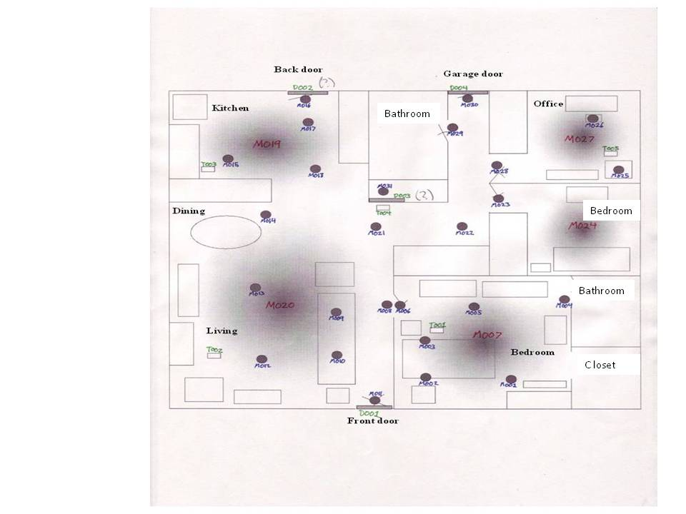
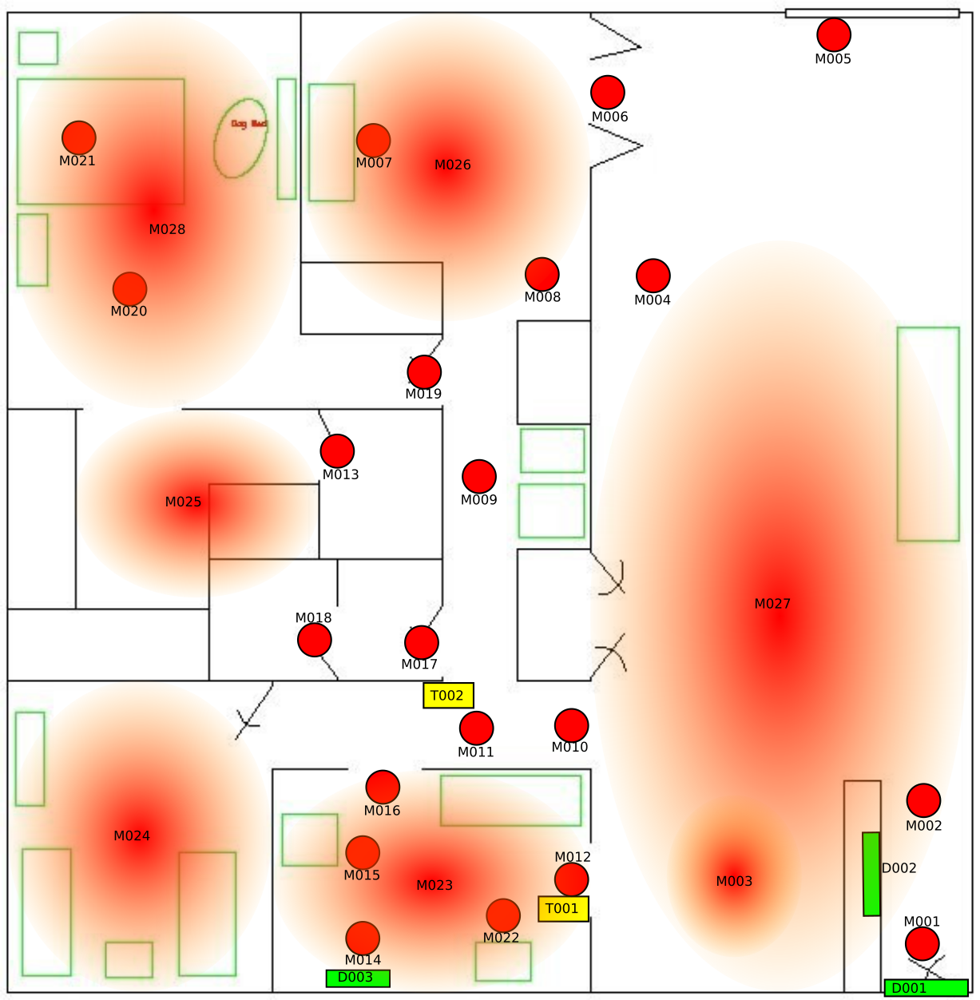
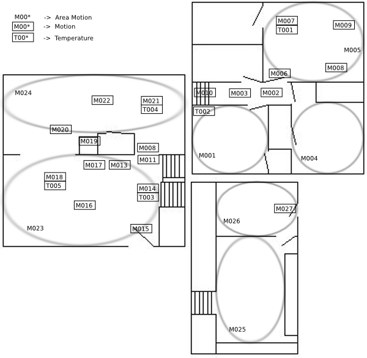
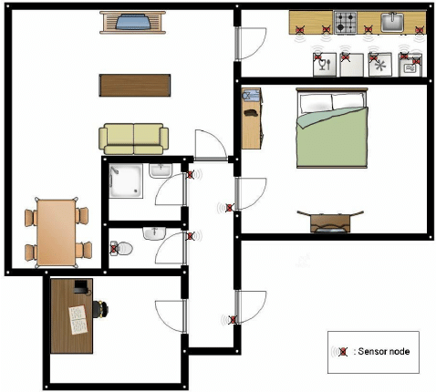
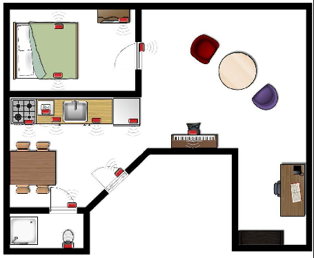
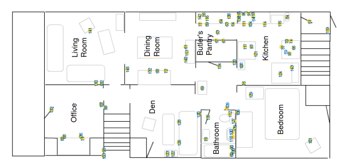
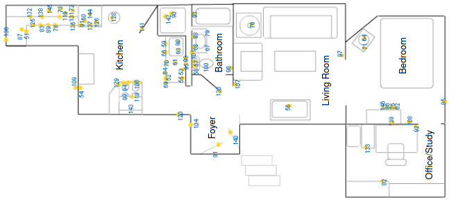

.. _dataset view:

Datasets
========

.. warning::
    Library is still currently an alpha pre-release. Thus, dataset information may be wrong or incomplete. 
    I am going to update this as soon as possible. Consequently, the following information is 
    given without any warranty to be correct. 

This page presents a comprehensive list of all supported datasets.
Activity information is presented in the format "Activities: #x/#X", where "#x" represents 
the number of distinct activities, and "#X" represents the total number of activity recordings. 
For example, "Activities: 7/263" indicates that the dataset contains 263 recordings of seven 
different activities. Additionally, the page provides activity coverage information, 
which includes the total time covered by activities #x and the number of data points with 
an corresponding activity label #X. Finally, the ``DeviceType`` attribute specifies whether the dataset 
contains *boolean*, *numerical*, or *categorical* devices.

Amsterdam
~~~~~~~~~

:Authors: T.L.M. van Kasteren; A. K. Noulas; G. Englebienne and B.J.A. Kroese
:Contact: t.l.m.vanKasteren@uva.nl
:Paper: Tenth International Conference on Ubiquitous Computing 2008 (Ubicomp '08)
:Organization: Universiteit van Amsterdam
:Link: https://sites.google.com/site/tim0306/
:From: 2008-02-25 00:20:14
:To: 2008-03-23 19:04:58
:Devices: 14/2620
:DeviceType: boolean
:Activities: 7/263
:Coverage: 0.88/0.77

To download the dataset execute

.. code:: python

    >>> from pyadlml.dataset import fetch_amsterdam
    >>> data = fetch_amsterdam()

.. note::

    To download the cleaned version of the amsterdam use

    .. code:: python

        clean_data = fetch_amsterdam(load_cleaned=True)

.. warning::

    The amsterdam's data cleaning removes intermediate and shifts successive days. Consequently, week-days
    can not be used as features since the timing of device activations and activities do
    not correspond to the correct days anymore.

Casas
~~~~~

:Authors: D. Cook
:Contact: hande.alemdar@boun.edu.tr
:Paper: WSU CASAS smart home project: D. Cook. Learning setting-generalized activity models for smart spaces. IEEE Intelligent Systems, 2011.
:organization: Washington State University

Aruba
-----

:Link: http://casas.wsu.edu/datasets/aruba.zip
:From: 2010-11-04 00:03:50
:To: 2011-06-11 23:58:10
:Devices: 39/1713065
:DeviceType: categorical, boolean, numerical
:Activities: 11/6474
:Coverage:  0.67/0.47

To download the dataset execute

.. code:: python

    from pyadlml.dataset import fetch_casas

    data = fetch_casas('aruba')

Tulum
-----

:Link: http://casas.wsu.edu/datasets/tulum2.zip
:From: 2009-09-25 12:49:51
:To: 2010-03-28 17:09:16.046637
:Devices: 36/1083181
:DeviceType: categorical, boolean, numerical
:Activites resident_1: 15/13391
:Coverage resident_1: 0.53/0.54
:Activites resident_2: 15/13406
:Coverage resident_2: 0.55/0.55

.. image:: _static/images/datasets/tulum.png
   :width: 1196px 
   :height: 971px
   :scale: 35 %
   :alt: alternate text
   :align: center

To download the dataset execute

.. code:: python

    from pyadlml.dataset import fetch_casas

    data = fetch_casas('tulum')

Milan
-----

:Link: http://casas.wsu.edu/datasets/milan.zip
:From: 2009-10-16 00:01:04
:To: 2010-01-06 12:48:47
:Devices: 33/428787
:DeviceType: categorical, boolean, numerical
:Activities: 15/2820
:Coverage: 0.60/0.68

To download the dataset execute

.. code:: python

    from pyadlml.dataset import fetch_casas

    data = fetch_casas('milan')

Kyoto
-----

:Link: http://casas.wsu.edu/datasets/twor.2010.zip
:From: 2009-08-24 00:00:00
:To: 2010-05-01 22:59:44
:Devices: 88/2798988
:DeviceType: categorical, boolean, numerical
:Activites resident_1: 13/1952
:Coverage resident_1: 0.24/0.20
:Activites resident_2: 12/1912
:Coverage resident_2: 0.28/0.21

.. image:: _static/images/datasets/kyoto.png
   :width: 1862px
   :height: 1280px
   :scale: 30 %
   :alt: alternate text
   :align: center

To download the dataset execute

.. code:: python

    from pyadlml.dataset import fetch_casas

    data = fetch_casas('kyoto')

Cairo
-----

:Link: http://casas.wsu.edu/datasets/cairo.zip
:From: 2009-06-10 00:00:00.024668
:To: 2009-08-05 23:59:14.053191
:Devices: 32/721913
:DeviceType: boolean, numerical
:Activities resident_1: 10/452
:Coverage resident_1: 0.09/0.19
:Activities resident_2: 10/453
:Coverage resident_2: 0.08/0.21

To download the dataset execute

.. code:: python

    from pyadlml.dataset import fetch_casas

    data = fetch_casas('cairo')
    

.. note::
    
    This dataset contains sensor data that was collected in the home of
    a volunteer adult couple.  The residents in the home were a man, a
    woman, and a dog. The activities consist of joint activities from man and 
    woman and the exclusive activities. The joint activities are duplicated
    in each dataframe.

    .. code:: python

        >>> from pyadlml.dataset import fetch_casas
        >>> data = fetch_casas('cairo')
        >>> print(data['activities']['resident_1']['activity'].unique())
        ['Night wandering' 'Bed to toilet' 'R1 wake' 'Breakfast' 'Leave home'
         'Lunch' 'Dinner' 'R1 sleep' 'R1 work in office' 'Laundry']

        >>> print(data['activities']['resident_2']['activity'].unique())
        ['Night wandering' 'Bed to toilet' 'R2 wake' 'R2 take medicine'
        'Breakfast' 'Leave home' 'Lunch' 'Dinner' 'R2 sleep' 'Laundry']

Aras
~~~~

:Authors: H. Alemdar, H. Ertan, O.D. Incel, C. Ersoy
:Contact: hande.alemdar@boun.edu.tr
:Paper: ARAS Human Activity Datasets in Multiple Homes with Multiple Residents, Pervasive Health, Venice, May 2013.
:Organization: Boğaziçi University Department of Computer Engineering
:Link: https://cmpe.boun.edu.tr/aras/
:From: 2000-01-01 00:00:00
:To: 2000-01-30 23:54:02
:Devices: 20/102233
:DeviceType: boolean
:Activites resident1:   25/1208
:Coverage resident1:    0.95/0.97
:Activites resident2:   22/734
:Coverage resident2:    0.97/0.98

To download the dataset execute

.. code:: python

    from pyadlml.dataset import fetch_aras

    data = fetch_aras(subject="Resident 1")

Kasteren 2010
~~~~~~~~~~~~~

:Authors: T.L.M. van Kasteren, G. Englebienne and B.J.A. Kroesse
:Contact: tim0306@gmail.com
:Paper: Transferring Knowledge of Activity Recognition across Sensor Networks. In Proceedings of the Eighth
        International Conference on Pervasive Computing. Helsinki, Finland, 2010.
:organization: todo
:Link: http://sites.google.com/site/tim0306/

House A
-------

:From: 2008-02-25 00:19:32
:To: 2008-03-23 19:04:47
:Devices: 14/2442
:DeviceType: boolean
:Activities: 16/327
:Coverage: 0.88/0.89

To download the dataset execute

.. code:: python

    from pyadlml.dataset import fetch_kasteren_2010

    data = fetch_kasteren_2010(house='A')

.. note::

    To download the cleaned version of the kasteren dataset type

    .. code:: python

        clean_data = fetch_kasteren_2010(house='A', load_cleaned=True)

House B
-------

:From: 2009-07-21 13:30:12
:To: 2009-08-17 13:49:19
:Activities: 24/204
:Devices: 22/36600
:DeviceType: boolean
:Coverage: 0.95/0.64

To download the dataset execute

.. code:: python

    from pyadlml.dataset import fetch_kasteren_2010

    data = fetch_kasteren_2010(house='B')

.. note::

    To download the cleaned version of the kasteren dataset type

    .. code:: python

        clean_data = fetch_kasteren_2010(house='B', load_cleaned=True)

House C
-------

:From: 2008-11-19 22:47:46
:To: 2008-12-08 08:15:00
:Activities: 17/374
:Devices: 21/43840
:DeviceType: boolean
:Coverage: 0.88/0.95

.. image:: _static/images/datasets/kasteren_2010_C.png
   :width: 600px
   :height: 400px
   :scale: 100 %
   :alt: alternate text
   :align: center

To download the dataset execute

.. code:: python

    from pyadlml.dataset import fetch_kasteren_2010

    data = fetch_kasteren_2010(house='C')

.. note::

    To download the cleaned version of the kasteren dataset type

    .. code:: python

        clean_data = fetch_kasteren_2010(house='C', load_cleaned=True)

MitLab
~~~~~~

:Authors: Emmanuel Munguia Tapia
:Contact: emunguia@media.mit.edu
:Paper: E. Munguia Tapia. Activity Recognition in the Home Setting Using Simple and Ubiquitous sensors. S.M Thesis
:Organization: Massachusetts Institute of Technology

Subject 1
---------

:From: 2003-03-27 06:42:04
:To: 2003-04-11 22:26:46
:Devices: 72/5196
:DeviceType: boolean
:Activities: 22/296
:Coverage: 0.16/0.95

To download execute

.. code:: python

    from pyadlml.dataset import fetch_mitlab

    data = fetch_mitlab(subject="subject1")

Subject 2
---------

:From: 2003-04-19 02:56:53
:To: 2003-05-04 22:23:42
:Devices: 68/3198
:DeviceType: boolean
:Activities: 24/219
:Coverage: 0.24/0.94

To download the dataset execute

.. code:: python

    from pyadlml.dataset import fetch_mitlab

    data = fetch_mitlab(subject="subject2")

UCI_ADL_Binary
~~~~~~~~~~~~~~

:Authors: Ordóñez, F.J.; de Toledo, P.; Sanchis, A. A
:Contact: fordonez@inf.uc3m.es
:Publication: Activity Recognition Using Hybrid Generative/Discriminative Models on Home Environments Using Binary Sensors. Sensors 2013, 13, 5460-5477.
:Organization: Carlos III University of Madrid
:Link: https://archive.ics.uci.edu/ml/datasets/Activities+of+Daily+Living+%28ADLs%29+Recognition+Using+Binary+Sensors

Ordonez A
---------

:From: 2011-11-28 02:27:59
:To: 2011-12-12 07:22:21
:Devices: 12/816
:DeviceType: boolean
:Activities: 9/248
:Coverage: 	0.95/0.93

To download the dataset use the ``subject`` parameter with  ``OrdonezA``

.. code:: python

    from pyadlml.dataset import fetch_uci_adl_binary

    data = fetch_uci_adl_binary(subject='OrdonezA')

.. note::

    To download the cleaned version of the uci dataset type

    .. code:: python

        clean_data = fetch_uci_adl_binary(subject='OrdonezA', load_cleaned=True)

Ordonez B
---------

:From: 2012-11-11 21:14:00
:To: 2012-12-03 01:03:59
:Devices: 12/4666
:DeviceType: boolean
:Activities: 10/493
:Coverage: 	0.88/0.64

To download the dataset use the ``subject`` parameter with  ``OrdonezB``

.. code:: python

    from pyadlml.dataset import fetch_uci_adl_binary

    data = fetch_uci_adl_binary(subject='OrdonezB')

.. note::

    To download the cleaned version of the uci dataset type

    .. code:: python

        clean_data = fetch_uci_adl_binary(subject='OrdonezB', load_cleaned=True)
