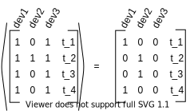

State-Vector-Encoding
*********************

Besides visualization there is not much use for the data as it is. Instead of a devices observation being a distinct event
at a given point :math:`t`, a state-vector representing all devices at that timepoint turns out to be more
convenient representation. Pyadlml support three different types of state-vectors, the *raw*, *changepoint* and *lastfired*
representation. The overall procedure to generate valid data is transforming the device dataframe into a specific representation
and then labeling the new representation by the recorded activities.

.. code:: python

    from pyadlml.preprocessing import SomeEncoder, LabelEncoder

    rep_enc = SomeEncoder(encode='some_representation', *args)
    enc_devs = rep_enc.fit_transform(data.df_devices)

    lbl_enc = LabelEncoder(*args)
    enc_lbls = lbl_enc.fit_transform(data.df_activities, rep_enc)

    X = enc_devs.values
    y = enc_lbls.values

Raw
~~~

.. image:: ../_static/images/reps/raw.svg
   :height: 300px
   :width: 500 px
   :scale: 90 %
   :alt: alternate text
   :align: center

The *raw* representation consists of a vector describing the state of the Smart Home at that given point in time.
Each field corresponds to the state a specific device is in at that given moment, as shown in the illustration above
for three different binary devices.

.. math::
    x_t = \begin{bmatrix} 1 & 0 & -1.348 & \text{ open } & ... & 1\end{bmatrix}^T \\
    \text{ where } x_{tk} \in \{\{0,1\} \cup \mathbb{R} \cup \text{Categorical}\}

The following example shows a binary event streams slice and the corresponding raw representations state matrix.

.. image:: ../_static/images/reps/raw_matrix.svg
   :height: 300px
   :width: 500 px
   :scale: 60 %
   :alt: alternate text
   :align: center

The most common smart home devices are binary by nature having either the state *on* or *off*. The BinaryEncoder
offers a method to transform an event stream into state-vectors while automatically preserving the correct values for
binary devices. To transform a device dataframe into the *raw* representation use the *BinaryEncoder* and *LabelEncoder*.

.. code:: python

    >>> from pyadlml.preprocessing import DiscreteEncoder, LabelEncoder

    >>> raw = DiscreteEncoder(rep='raw').fit_transform(data.df_devices)
    >>> labels = LabelEncoder().fit_transform(data.df_activities, raw)

    >>> print(raw.head())
    >>> print(labels.head())

.. note::
    There are some devices that produce numerical or categorical values. The *BinaryEncoder* still
    yields correct state-vectors including these devices. However a devices numerical or categorical value
    within a state-vector at time-points where the device does not emit an observation are filled with ``NaN``s
    and have to be handled explicitly by the coder afterwards.

Changepoint
~~~~~~~~~~~

.. image:: ../_static/images/reps/cp.svg
   :height: 300px
   :width: 500 px
   :scale: 90 %
   :alt: alternate text
   :align: center

The changepoint representation uses a binary vector to represent the state of the smart home at a given point :math:`t`.
Each field within the vector corresponds to a device. A field possesses the value 1 at timepoint :math:`t`
if and only if the device is responsible for generating the current event. Otherwise all device fields are set to 0. For
e.g a binary device the field is 1, when the state changes from 1 to 0 or from 0 to 1. The changepoint representation
tries to capture the notion that device triggers convey information about the inhabitants activity.
The picture below shows a *raw* representation matrix and its *changepoint* counterpart.

The changepoint representation can be loaded by using the ``encode`` argument.

.. code:: python

    from pyadlml.preprocessing import DiscreteEncoder, LabelEncoder

    raw = DiscreteEncoder(encode='changepoint').fit_transform(data.df_devices)
    labels = LabelEncoder().fit_transform(data.df_activities, raw)

    X = raw.values
    y = labels.values

LastFired
~~~~~~~~~

.. image:: ../_static/images/reps/lf.svg
   :height: 300px
   :width: 500 px
   :scale: 90 %
   :alt: alternate text
   :align: center

The *last_fired* representation uses binary vectors to represent the state of the smart home at a given point
:math:`t` in time. Each field in the vector corresponds to a device. A field possesses the value 1 at
timepoint :math:`t` if and only if the device was the last to change its state from 1 to 0 or from 0 to 1 for
:math:`s<t` Otherwise all fields assume the state 0. The *last_fired* representation is a variation of the
*changepoint* representation. The picture below shows a *raw* representation matrix and its
*last_fired* counterpart.

.. image:: ../_static/images/reps/lf_matrix.svg
   :height: 300px
   :width: 500 px
   :scale: 60 %
   :alt: alternate text
   :align: center

To transform a device dataframe into the *last_fired* representation use

.. code:: python

    from pyadlml.preprocessing import DiscreteEncoder, LabelEncoder

    raw = DiscreteEncoder(rep='last_fired').fit_transform(data.df_devices)
    labels = LabelEncoder(raw).fit_transform(data.df_activities)

    X = raw.values
    y = labels.values

Combining Encodings
~~~~~~~~~~~~~~~~~~~

It may be of use to combine different encodings, e.g the *raw* representation and the *lastfired* representation.
This can be achieved by concatenating the encodings with a ``+`` in for the encoding parameter.
The following code shows how to

.. code:: python

    from pyadlml.preprocessing import DiscreteEncoder, LabelEncoder

    raw = DiscreteEncoder(rep='raw+lastfired').fit_transform(data.df_devices)
    X = raw.values

