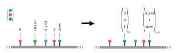
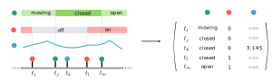

State-Vector encoding
*********************

Beside visualizations there is not much use for the data as it is. Instead of device observations being distinct events
at given timepoints :math:`t`, a state-vector representing all devices at that timepoint turns out to be the more
convenient representation. Pyadlml supports three different types of state-vectors, the *raw*, *changepoint* and *lastfired*
encoding. The overall procedure to generate encoded data and correct labels, is transforming the device dataframe into a specific representation
and labeling the new representation by the recorded activities afterwards.

.. code:: python

    from pyadlml.preprocessing import StateVectorEncoder, LabelEncoder

    rep_enc = StateVectorEncoder(encode='some_representation', *args)
    enc_devs = rep_enc.fit_transform(data.df_devices)

    lbl_enc = LabelEncoder(*args)
    enc_lbls = lbl_enc.fit_transform(data.df_activities, enc_devs)

    X = enc_devs.values
    y = enc_lbls.values

Raw
~~~

Definition
==========

The *raw* representation consists of a vector describing a Smart Home's state at that given point in time.
Each vector field corresponds to the state a specific device is in at that given moment. This is shown exemplary for
three different binary devices in the illustration above. In addition to binary values, numerical as well as categorical
values are supported

.. math::
    x_t = \begin{bmatrix} 1 & 0 & -1.348 & \text{ open } & ... & 1\end{bmatrix}^T \\
    \text{ where } x_{tk} \in \{\{0,1\} \cup \mathbb{R} \cup \text{Categorical}\}

Example
=======
The following example shows a binary event-streams slice and the corresponding raw representation state matrix.

.. image:: ../_static/images/encodings/raw_matrix.svg
   :height: 300px
   :width: 500 px
   :scale: 60 %
   :alt: alternate text
   :align: center

The `StateVectorEncoder` offers a method to transform an event stream into state-vectors. To transform a device dataframe
to the *raw* representation and generate correct corresponding labels, use the *StateVectorEncoder* in conjunction with the *LabelEncoder*

.. code:: python

    >>> from pyadlml.preprocessing import StateVectorEncoder, LabelEncoder

    >>> raw = StateVectorEncoder(encode='raw').fit_transform(data.df_devices)
    >>> labels = LabelEncoder().fit_transform(data.df_activities, raw)

    >>> print(raw.head())
    ... TODO
    >>> print(labels.head())
    ... TODO

Unknown values
==============

When encoding state-vectors previous device values are used to fill in the fields for all devices except for the device
that fired. Events that precede the timepoint at which a certain device fires for the first time have to infer the
devices value for those events. In the binary case correct values can be inferred by simply inverting
the first occurring value. For categorical values the *StateVectorEncoder* still yields the most likely state-vectors,
where the preceding category is calculated as the most probable category :math:`p(c_{<t}|c_t)`. However the handling
of numerical values is left to the user. Numerical values within a state-vector at time-points where the device does
not emit observations are filled with ``NaN``'s. To ensure working with correct values only, retrieve the timestamp
where all devices fired at least once and use the dataframe from that point forward

.. code:: python

    raw = StateVectorEncoder(encode='raw').fit_transform(data.df_devices)

    # get time string of last device that fired for the first time
    timestr = TODO

    # select all values after the device
    raw = raw[raw['time'] > timestr]

Changepoint
~~~~~~~~~~~

Definition
==========
.. image:: ../_static/images/encodings/cp.svg
   :height: 300px
   :width: 500 px
   :scale: 90 %
   :alt: alternate text
   :align: center

The changepoint representation is a one-hot encoding of all devices indicating the device that generated the event.
A field  possesses the value 1 at timepoint :math:`t` if and only if the device is responsible for producing the current
event, otherwise all device fields are set to 0. For e.g binary devices the field is 1, when the state changes from
1 to 0 or from 0 to 1. The changepoint representation tries to capture the notion that device triggers convey information
about the inhabitants activity.

Example
=======

The picture below shows a *raw* representation matrix and its *changepoint* counterpart.

.. image:: ../_static/images/encodings/cp_matrix.svg
   :height: 300px
   :width: 500 px
   :scale: 60 %
   :alt: alternate text
   :align: center

A changepoint representation can be loaded by using the ``encode='changepoint'`` argument.

.. code:: python

    from pyadlml.preprocessing import StateVectorEncoder, LabelEncoder

    cp = StateVectorEncoder(encode='changepoint').fit_transform(data.df_devices)
    labels = LabelEncoder().fit_transform(data.df_activities, cp)

    X = cp.values
    y = labels.values

LastFired
~~~~~~~~~

Definition
==========

.. image:: ../_static/images/encodings/lf.svg
   :height: 300px
   :width: 500 px
   :scale: 90 %
   :alt: alternate text
   :align: center

The *last_fired* representation is a one-hot-encoding of all devices, indicating the device that fired last. Each field
in the vector corresponds to a device. A field possesses the value 1 at timepoint :math:`t`, if and only if the device
was the last to change its state from 1 to 0 or from 0 to 1 for :math:`s<t`. Otherwise all fields assume the state 0.
If the data is not up- or downsampled the *last_fired* representation is the same as the *changepoint* representation.

Example
=======

The picture below shows a *raw* representation matrix and its *last_fired* counterpart.

.. image:: ../_static/images/encodings/lf_matrix.svg
   :height: 300px
   :width: 500 px
   :scale: 60 %
   :alt: alternate text
   :align: center

To transform a device dataframe into the *last_fired* representation use the ``encode='last_fired'`` argument

.. code:: python

    from pyadlml.preprocessing import DiscreteEncoder, LabelEncoder

    raw = DiscreteEncoder(encode='last_fired').fit_transform(data.df_devices)
    labels = LabelEncoder(raw).fit_transform(data.df_activities)

    X = raw.values
    y = labels.values

Combining Encodings
~~~~~~~~~~~~~~~~~~~

In most cases it is reasonable to combine different encodings, e.g the *raw* representation and the *lastfired* representation.
This can be achieved by creating a string concatenating different encodings using a ``+`` for encode parameter.
The following code shows how to combine the *raw* and the *last_fired* encoding.

.. code:: python

    X = StateVectorEncoder(encode='raw+lastfired')\
        .fit_transform(data.df_devices)\
        .values

    print(X.head())
    >>> TODO ...

