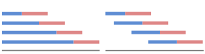
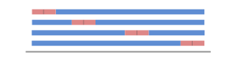
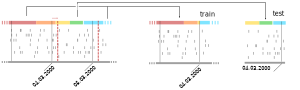

8. Hyperparameter search
========================

A common technique to estimate hyperparameters is by cross-validation. Sklearn offers
a variety of methods for performing this task.
Pyadlml extends the ``TimeseriesSplit`` and introduces a novel ``LeaveKDaysOutSplit``,
that perpetuates the LeaveOneDayOut split from Kasteren(cite).
Using pyadlml's ``pipeline`` with the ``StateVectorEncoder`` or the
``LabelEncoder`` gives rise to problems when applying sklearn's splits or search methods.
Therefore pyadlml wraps most of sklearn's cross validators to enable make use of them.
In addition an *online-split* and a *temporal-split* are introduced to enable using the pipeline
and upsampled data.

Timeseries split
~~~~~~~~~~~~~~~~

The timeseries split

.. code:: python

    >>> from pyadlml.dataset import fetch_amsterdam
    >>> from pyadlml.model_selection import TimeSeriesSplit

    >>> data = fetch_amsterdam()

    >>> ts = TimeSeriesSplit(n_splits=5)
    >>> splits = ts.split(data.df_devices)

    >>> print(splits)

LeaveKDayOut split
~~~~~~~~~~~~~~~~~~

The ``LeaveKDayOut`` split removes :math:`k` days from the whole dataset as test set and uses the rest as training set.
Hereby the data succeeding the removed day are shifted by k-days into the past to close the gap. This does not
lead to data leakage from training into the test set as each day is seen as independent of each other.

The following example shows how to do four splits, where each test split is two days long.

.. code:: python

    >>> from pyadlml.model_selection import LeaveKDayOutSplit

    >>> ts = LeaveKDayOutSplit(n_splits=4, k=2)
    >>> x_train, x_test = ts.split(data.df_devices)
    >>> print(x_train)
    >>> print(x_test)

Sometimes it is not reasonable to define the start/end point of a daily period at midnight as
the inhabitants behavioural pattern may differ. This could be when e.g the inhabitant
regularly goes to bed at 2 o clock.

To mitigate this behaviour an offset can be added to
midnight in order to adjust the period. Take a look at (TODO link to device vs. activity plot)
in order to determine a reasonable offset. The below example chooses the a period from 2 o clock
to the next day by setting the ``offset='2h'``

.. code:: python

    >>> ts = LeaveKDayOutSplit(n_splits=4, k=2, offset='2h')
    >>> x_train, x_test = ts.split(data.df_devices)
    >>> print(x_train)
    >>> print(x_test)

Online split
~~~~~~~~~~~~

Cross-validation splits return a indices list for train and validation set.
Then a train and test set is selected using the splits and the pipeline is fitted and evaluated
afterwards. As the ``LabelEncoder`` generates labels inside the pipeline the labels train selection
can not be determined before the pipeline is fitted. In order to include the ``LabelEncoder``'s
parameters in the search, the splits have to be made in an online fashion during fitting.
By including an additional step within a pipeline that selects the train- or validation
set after devices and activities have been encoded cross-validation becomes possible.

The additional step contains the ``CVSplitter`` transformer, that selects the
appropriate subset of the whole dataset:

.. code:: python

    from pyadlml.dataset import fetch_amsterdam
    from pyadlml.preprocessing import StateVectorEncoder, LabelEncoder

    # load data and get encoded vectors
    data = fetch_amsterdam()
    X = StateVectorEncoder().fit_transform(data.df_devices)
    y = LabelEncoder().fit_transform(data.df_activities, X)

    # example indices for train and validation set
    train_index = [0,1,2,3,5,6,7]
    val_index = [8,9,10]

    # select train subset
    train_splitter = CVSplitter(data_range=train_index)
    X_train, y_train = train_splitter.transform(X, y)

    # select validation subset
    val_splitter = CVSplitter(data_range=val_index)
    X_val, y_val = train_splitter.transform(X, y)

To train a whole pipeline, we make use of the fact that steps can be conditional executed
in different modes. By wrapping one ``CVSplitter`` with the ``TrainOnlyWrapper``,
another with the ``EvalOnlyWrapper`` and passing the respective indices ranges as parameters
the *online-split*  can be achieved. The following example shows a `KFold`
cross validation, fitting a whole pipeline by using splitting train and test set within the pipe:

.. code:: python

    from pyadlml.preprocessing import StateVectorEncoder, LabelEncoder
    from pyadlml.model_selection import KFold, train_test_split
    from pyadlml.dataset import fetch_amsterdam

    # get data and split into training and testing
    data = fetch_amsterdam()
    X_train, y_train, X_test, y_test = train_test_split(data.df_devices, data.df_activities)

    # initialize standard KFold cross-validation
    cv = KFold(n_splits=5)

    scores = []
    for train_idxs, val_idxs in cv.split(X_train, y_train):
        steps = [
            ('sve', StateVectorEncoder(encode='raw')),
            ('le', TrainOrEvalOnlyWrapper(LabelEncoder(idle=False))),
            ('train_split', TrainOnlyWrapper(CVSplitter(train_idxs))),
            ('val_split', EvalOnlyWrapper(CVSplitter(val_idxs))),
            ('drop_time_idx', DropTimeIndex()),
            ('drop_duplicates', TrainOnlyWrapper(DropDuplicates())),
            ('classifier', RandomForestClassifier(random_state=42))
        ]
        # create pipeline in training mode
        pipe = Pipeline(steps).train()
        pipe.fit(X_train, y_train)

        # set pipeline to evaluation and score
        pipe.eval()
        scores.append(pipe.score(X_train, y_train))

    scores = np.array(scores)
    print('scores of the pipeline: {}'.format(scores))
    print('mean score: {:.3f}'.format(scores.mean()))

Temporal split
~~~~~~~~~~~~~~

As the ``StateVectorEncoder`` may up- or downsample datapoints dependent on the resolution :math:`dt`,
the train- and testindices are not known beforehand.
If e.g the data is upsampled to a certain size with :math:`dt=3s`

The ``LeaveKDayOutSplit`` and the ``TimseriesSplit`` will return a timestamps tuple indicating the beginning
and end of test and train set rather than indicies.

.. code:: python

    >>> from pyadlml.model_selection import TimeSeriesSplit

    >>> cv = TimeSeriesSplit(temporal_split=True)
    >>> (train_int, test_int) = cv.split(X_train, y_train)
    >>> print(train_int[0])
    ['09.90123.','1231], ['09.90123.','1231],
    >>> print(train_int[0], test_int)

The cross validation ``CVSplitter`` is able to detect automatically if the passed
date_range are timestamps or indices and will split accordingly. Note that for a temporal split
the passed dataframes have to contain the column TIME.