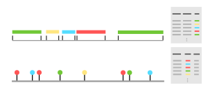

.. _Dataset user guide:

2. Datasets
***********

.. _activity_dataframe:

Usually a dataset is composed of two dataframes, the logged activities and the recorded device readings.
An activity dataframes entry consists of the *start_time*, the *end_time*  and the *activity*
that is being performed:

.. csv-table:: 
   :header: "start_time", "end_time", "activity"
   :widths: 30, 30, 10

    27-12-2020 16:35:13.936,27-12-2020 17:35:23.397,eating
    27-12-2020 17:35:24.021,28-12-2020 03:35:29.806,going_to_bed
    28-12-2020 03:35:32.808,28-12-2020 03:40:36.057,waking_up
    ...

.. _device_dataframe:

A device dataframe entry consists of the *time* a certain *device* reported a
specific *value*. While the majority of Smart Home devices are binary, pyadlml 
supports categorical or numerical device values as well:

.. csv-table:: 
   :header: "time", "device", "value"
   :widths: 30, 20, 10

    2020-12-27 15:35:08.124228,light.bathroom, False
    2020-12-27 15:45:10.470072,switch.bedroom_device, True
    2020-12-27 17:35:11.961696,temp.sensor 3,13.84
    ...

.. Note::
    Currently, pyadlml provides support for 12 datasets. If you happen to encounter 
    a dataset missing here `list`_,  do not hesitate to open an issue on GitHub. 
    I am committed to expanding the library and will work to include any relevant 
    datasets that are brought to my attention.

Getting the data
================

A dataset is loaded using a function following the schema

.. py:function:: pyadlml.dataset.fetch_datasetname(cache=True, keep_original=False, retain_corrections=False, folder_path=None)

   Returns a dictionary with attributes *activities* and *devices*

For an exhaustive list and detailed dataset information visit :ref:`datasets <Dataset View>`.
The example below shows the :ref:`amsterdam <amsterdam>` dataset being loaded

.. code:: python

    >>> from pyadlml.dataset import fetch_amsterdam

    >>> data = fetch_amsterdam()
    >>> data.keys()
    ['activities', 'devices', 'activity_list', 'device_list']

    >>> print(data['devices'])
                        time             device  value
    0    2008-02-25 00:20:14  Hall-Bedroom door   True
    1    2008-02-25 00:22:57  Hall-Bedroom door  False
    ...
    2619 2008-03-23 19:04:47          Frontdoor  False
    [2620 rows x 3 columns]

    >>> print(data['activities'])
                     start_time            end_time        activity
    0   2008-02-25 19:40:26.000 2008-02-25 20:22:58  prepare Dinner
    1   2008-02-25 20:23:12.000 2008-02-25 20:23:35       get drink
    ...
    262 2008-03-21 19:10:36.000 2008-03-23 19:04:58     leave house
    [263 rows x 3 columns]

.. note::
    In certain instances, researchers record activities for multiple occupants 
    living within the same Smart Home. When this is the case, the dictionary
    key ``activities`` refers to another dictionary where a subject identifier 
    maps to the respective activity dataframe. 

    .. code:: python

        >>> from pyadlml.dataset import fetch_aras

        >>> data = fetch_aras()
        >>> print(data['activities'].keys())
        ['subject 1', 'subject 2']

.. _storage_and_cache:

Storage and cache
=================

By default, datasets are stored in ``/tmp/pyadlml_data_home``. Given that device and activity 
representations in the original datasets often vary, pyadlml preprocesses these datasets  
which can be time-consuming. However, users can speed up future fetch calls by
setting the ``cache`` parameter within the ``fetch_dataset`` function to ``True``. This 
stores the processed dataset as a binary file after the first call, that
is then used for all subsequent fetch calls. To change the directory where the 
datasets are stored use

.. code:: python

    from pyadlml.dataset import fetch_aras
    from pyadlml.dataset.io import set_data_home

    # Set the save-folder to '/path/to/folder' for this session
    set_data_home('/path/to/folder/')

    # The original aras dataset will be saved to '/path/to/folder/aras/original/'
    # The cached version will be saved to '/path/to/folder/aras/aras.joblib'
    data = fetch_aras(cache=True, keep_original=True)

Coming from Activity Assistant
==============================
For users who have collected their own data using `Activity Assistant`_, load the dataset 
by first extracting the ``dataset_name.zip`` file

::

    $ cd /path/to/
    $ unzip dataset_name.zip
    $ ls /path/to/dataset_name
      devices.csv
      device_map.csv
      activities_chris.csv
      activity_map.csv

and pointing pyadlml to the folder containing the zip's content

.. code:: python

    from pyadlml.dataset import load_act_assist

    data = load_act_assist('/path/to/dataset_name/', subjects=['chris'])

.. note::
    Activity Assistant creates an activity file using the naming convention ``activities_[subject_name].csv``.
    The activity dataframe can be accessed from dictionary with ``data['activities'][subject_name]``.

.. _error_correction:

Data cleaning
=============

Automatic correction
~~~~~~~~~~~~~~~~~~~~

To ensure the correct computation of all summary statistics or data transformations, pyadlml imposes some
constraints on the structure of activity and device dataframes. For example, activity intervals should not
overlap, device events should not occur at exactly the same moment in time and directly succeeding 
binary device events have to differ in value. To address issues with datasets not meeting these requirements,
the ``fetch_dataset`` method applies correction before returning the dataset. For full transparency, passing
the parameter ``retain_correction=True`` to the ``fetch_dataset`` method will store the activity 
and device corrections made during cleaning in the returned dictionary.

Activity correction
^^^^^^^^^^^^^^^^^^^

Altered activity entries are accessed by the key ``'correction_activities'``.
The returned list contains tuples, where the first item is a list of overlapping 
activity sets before and the second item after the correction.

.. code:: python

    >>> from pyadlml.dataset import fetch_uci_adl_binary
    >>> data = fetch_uci_adl_binary(subject='OrdonezB', retain_corrections=True)
    >>> data.keys()
    ['activities', 'devices', 'correction_activities_OrdonezB', ...]

    >>> corr_lst = data['correction_activities_OrdonezB']
    >>> print(len(corr_lst))
    23
    >>> # Overlapping activities before correction
    >>> print(corr_lst[0][0])
                start_time            end_time   activity
    69 2012-11-14 00:28:00 2012-11-14 00:29:59  Toileting
    70 2012-11-14 00:29:00 2012-11-14 05:12:59   Sleeping

    >>> # Corrected activities as present in the data['activities']
    >>> print(corr_lst[0][1])
                   start_time            end_time   activity
    0 2012-11-14 00:28:00.000 2012-11-14 00:29:00  Toileting
    1 2012-11-14 00:29:00.001 2012-11-14 05:12:59   Sleeping

Device correction
^^^^^^^^^^^^^^^^^

Devices are corrected by dropping duplicate entries, modifying entries where the timestamps
coincide and disregarding equal pairwise succeeding values of binary devices.
In cases where two entries share the same timestamp, one of the entries is chosen at random
and a small offset is added to the timestamp. The attribute ``'correction_devices_duplicate_timestamp'``
provides access to the rows with altered timetamps. When a binary device reports the same value in direct succession, 
the corresponding redundant entry is dropped. The removed rows are accessed through the 
attribute ``'correction_devices_on_off_inconsistency'``.

.. code:: python

    >>> # print the dropped entries where binary device activation was inconsistent
    >>> print(data['correction_devices_on_off_inconsistency'])
                            time           device  value
    274  2012-11-12 22:34:27.000  Living Door PIR  False
    302  2012-11-12 23:45:08.000  Living Door PIR  False
    1732 2012-11-19 15:52:33.000  Living Door PIR   True
    4668 2012-11-12 22:34:27.010  Living Door PIR  False
    4669 2012-11-12 23:45:08.010  Living Door PIR  False
    4670 2012-11-19 15:52:33.010  Living Door PIR   True

    >>> # print the entries where the timestamps were altered
    >>> print(data['correction_devices_duplicate_timestamp'])
                        time                device  value
    4027 2012-11-30 12:56:27  Living Seat Pressure   True
    4129 2012-12-01 00:04:58  Living Seat Pressure  False

Data quality
~~~~~~~~~~~~

Although the automatic correction applies heuristics to correct the most significant inconsistencies, 
some dataset still require additional cleaning. Recording correct and meaningful data is a challenging task. 
For instance, dropping a single device event during recording can lead to an incorrect device state
being assumed for days. Additionally, there may be days where the inhabitant does not record any 
activities. Although many or prolonged gaps between recordings do not pose problems when
the dataset is used for unsupervised or semi-supervised learning, reduced activity coverage can be 
detrimental when the task is supervised learning. 
Infrequent occurences of certain activities or devices can negatively impact model performance.
To facilitate more comparable datasets, the cleaning process also involves removing activities
or devices that do not meaningfuly contribute to the given task.
For these reasons, most ``fetch_dataset`` method include the ``load_cleaned`` parameter. When set, a 
cleaned version of the dataset is loaded instead of the original. Since the cleaning process is 
subjective, the steps are recorded to ensure transparency and reproducibility. 

All evaluations and model rankings reported in this `project`_ are based on the cleaned datasets.
When training and evaluating supervised models, it is recommended to start with the cleaned datasets:

.. code:: python

    >>> from pyadlml.dataset import fetch_kasteren_2010
    >>> data = fetch_kasteren_2010(house='A', load_cleaned=True)
    >>> df_devs, df_acts = data['devices'], data['activities']

Methods for cleaning
~~~~~~~~~~~~~~~~~~~~

Pyadlml offers various methods to facilitate the data cleaning process. For instance, 
to include activities and devices within only a specific timespan use

.. code:: python

    >>> from pyadlml.dataset.util import select_timespan
    >>> df_devs, df_acts = select_timespan(df_devs, df_acts, 
    >>>         start_time='12.03.1995', end_time='15.03.1995')

To exclude days use the ``remove_days`` method. Optionally shift succeeding 
or preceeding activities and device readings to close the resulting gaps:

.. code:: python

    >>> from pyadlml.dataset.util import remove_days

    >>> # Removes the given days and shifts all succeeding activities and events by one day
    >>> # in order to close the emerging gaps
    >>> df_devs, df_acts = remove_days(df_devs, df_acts, days=['12.03.2001', '18.04.2001'])

Furthermore, TODO

.. code:: python

    >>> from pyadlml.dataset.util import remove_signal
    >>> search_signal = [
        ('1s', True),
        ('5s', False),
        ('10s', True),
        ('3s', True),
    ]
    >>> df_devs = remove_signal(df_devs, search_signal=search_signal, match_on_index=1, threshold=40)

Tools
~~~~~

The ``/path/to/pyadlml/tools`` subdirectory on the github repository provides 
interactive dash applications to help data wrangling. Every tool generates code 
that can be applied to an activity or device dataframe.

.. code:: python

    >>> from pyadlml.dataset.util import update_df
    >>> df_acts_cleaned = update_df(df_acts_old, '/path/to/generated_cleaning_code.py')

Merge overlapping activities
^^^^^^^^^^^^^^^^^^^^^^^^^^^^

This package does not allow for an activity to overlap an other. To resolve overlapping activities
use the following tool.  

::

    $ cd pyadlml/tools
    $ python correct_activities.py -d kasteren_C -o /tmp/pyadlml/

.. image:: ../_static/gifs/activity_correction.gif
   :height: 400px
   :width: 700 px
   :scale: 100 %
   :alt: alternate text
   :align: center

Filter binary signals
^^^^^^^^^^^^^^^^^^^^^

In some cases, hardware is not properly configured, resulting in the generation of
unwanted device signal patterns. For example, a switch that is not configured for debouncing
may report a short on-state everytime it is turned off.
While, one might consider these artifacts to be part of the dataset,  
it is the researchers responsibility to address any hardware issues during the experiment.
Moreover, removing artifacts can help make algorithms more comparable across different datasets.
To identify faulty device states, the tool uses cross-correlation to match candidate patterns 
for a given search pattern. Users can simply click on the pattern to remove it:

::

    $ cd pyadlml/tools
    $ python clean_device_signals.py -p 8060 -d kasteren_C -o /tmp/pyadlml/

.. image:: ../_static/gifs/clean_device_signals.gif
   :height: 400px
   :width: 700 px
   :scale: 100 %
   :alt: alternate text
   :align: center

.. note::

    In addition, the tool can be used to find a reasonable threshold in order
    to remove the pattern automatically. Open the tool and determine a 
    threshold i.e. 40.

    .. code python::
        >>> from pyadlml.dataset.cleaning import asdf
        >>> asdf.()

Relabel devices and activities 
^^^^^^^^^^^^^^^^^^^^^^^^^^^^^^

As is often the case, device recordings and activities contain errors. Furthermore, start- 
and endtime of activities often lack rigorously definition. At times, a researcher may opt 
to redefine these boundaries in a consistent manner post-experiment to improve the mututal information 
between activities and devices. For these purposes, the ``label_data.py`` tool can be used
to relabel categorical, binary devices and activities:

::

    $ cd pyadlml/tools
    $ python label_data.py -p 8060 -d kasteren_C -o /tmp/pyadlml/

.. image:: ../_static/gifs/label_data.gif
   :height: 400px
   :width: 700 px
   :scale: 100 %
   :alt: alternate text
   :align: center

.. _list: https://todo_link_to_datasets
.. _notebooks: https://github.com/tcsvn/pyadlml/notebooks/
.. _Activity Assistant: https://github.com/tcsvn/activity-assistant
.. _project: https://TODO
.. _hard: https://github.com/tscvn/pyadlml/notebooks/tuebingen_2019.ipynb

