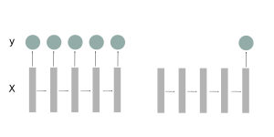

5. Feature extraction
=====================

The following methods are used to extract features from the *time* devices triggers.
TODO introductionary sentence

Time of day
~~~~~~~~~~~
As can be seen (link) activities happen during different times of the day. Therefore
it may be useful to binning the a day into features that . This can be done using the
``TimeOfDayExtractor`` and passing a binsize as in the following example

.. code:: python

    >>> from pyadlml.dataset import fetch_aras
    >>> from pyadlml.feature_extraction import TimeOfDayExtractor

    # load data and encode as state-vector
    >>> data = fetch_aras()
    >>> raw = StateVectorEncoder(encode='raw')\
           .fit_transform(data.df_devices)

    # extract the time of a day with a bin size of 2h, will result in 12 new features
    >>> tode = TimeOfDayExtractor(dt='2h')

    # return device dataframe containing one row with strings representing the bins
    >>> tode.fit_transform(raw)
    index, time_of_day
    1, '09:00:00 - 10:00:00'
    2, '09:00:00 - 10:00:00'
    ...
    2901, '21:00:00 - 22:00:00'

    # Append to the current encoded vectors  as one hot encoding
    >>> tode.inline=True
    >>> tode.one_hot_encoding=True
    >>> tode.fit_transform(raw)
    , time, features, '00:00:00 - 02:00:00', ..., '22:00:00 - 24:00:00'
    1, timestamp1, ..., 1, 0, ..., 0
    2, timestamp1, ..., 1, 0, ..., 0
    ...
    2901, timestamp1, ..., 0, 0, ..., 1, 0

    # Note that this could also be achieved by setting these values as parameters

.. note::
    Decreasing ``TimeOfDayExtractor`` bin-resolution increases the number of features.
    To many features may hinder a models capability to generalize. Therefore
    care has to be taken when considering the choice of resolution.

Inter event interval
~~~~~~~~~~~~~~~~~~~~

.. code:: python

    from pyadlml.feature_extraction import TimeDiffExtractor

    raw = StateVectorEncoder(encode='raw').fit_transform(data.df_devices)

    # add a dataframe column that includes the time differences to the predecessor
    raw = TimeDiffExtractor(direction='to_predecessor', inline=True).fit_transform(raw)

bla

Day of week
~~~~~~~~~~~

Some activities may happen at different times depending on the day they occur. Therefore
*pyadlml* offers to extract the day of the week as a feature.

.. code:: python

    >>> from pyadlml.dataset import fetch_aras
    >>> from pyadlml.feature_extraction import DayOfWeekExtractor

    # load data and encode as state-vector
    >>> data = fetch_aras()
    >>> raw = StateVectorEncoder(encode='raw')\
           .fit_transform(data.df_devices)

    # extract the time of a day with a bin size of 2h, will result in 12 new features
    >>> dowe = DayOfWeekExtractor()

    # return device dataframe containing one row with strings representing the bins
    >>> dowe.fit_transform(raw)
    index, day_of_week
    1, 'Monday'
    2, 'Monday'
    ...
    2901, 'Saturday'

    # Append to the current encoded vectors  as one hot encoding
    >>> dowe.inline=True
    >>> dowe.one_hot_encoding=True
    >>> dowe.fit_transform(raw)
    , time, features, 'Monday', ..., 'Sunday'
    1, timestamp1, ..., 1, 0, ..., 0
    2, timestamp1, ..., 1, 0, ..., 0
    ...
    2901, timestamp1, ..., 0, 0, ..., 1, 0

Special transformers
~~~~~~~~~~~~~~~~~~~~

Some models like e.g neural nets perform better on batched data instead of a single sequence.
The *many-to-one* representation TODO ... and the *many-to-many*  TODO ...
Pyadlml offers two ways to chop up sequences, the and the representation.
Both transformation are done using the ``SequenceDicer``.

Many-To-Many
^^^^^^^^^^^^

To get *many-to-many* batches use the window size :math:`w` to split the data

.. math::
    f(X_{N,K},y_{N}) \rightarrow (X_{W, N,K}, y_{W, N})

In addition you can specify a stride.

.. code:: python

    from pyadlml.preprocessing import SequenceDicer

    raw = StateVectorEncoder(encode='raw', t_res='10s')\
          .fit_transform(data.df_devices)
    labels = LabelEncoder().fit_transform(raw, data.df_activities)

    X = raw.values
    y = labels.values

    X, y = SequenceDicer(rep='many-to-many', window_length='5m')\
           .fit_transform(X, y)

Many-To-One
^^^^^^^^^^^

.. math::
    f(X_{N,K},y_{N}) \rightarrow (X_{W, N, K}, y_{N})

.. image:: ../_static/images/reps/image.svg
   :height: 200px
   :width: 500 px
   :scale: 80%
   :alt: alternate text
   :align: center

.. code:: python

    from pyadlml.preprocessing import SequenceDicer

    raw = StateVectorEncoder(encode='raw', t_res='10s')\
          .fit_transform(data.df_devices)
    labels = LabelEncoder().fit_transform(raw, data.df_activities)

    X = raw.values
    y = labels.values

    X, y = SequenceDicer(rep='many-to-one', window_length='20s')\
           .fit_transform(X, y)