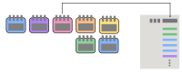

5. Feature extraction
=====================

The following transformers can be used to extract features from the *timestamps* devices triggers.
In general you can choose whether to solely return the extracted values or to append it to
a given dataframe as one-hot encoding or feature column.

Time of day
~~~~~~~~~~~

As can be seen (link) activities happen during different times of the day. Therefore
it may be useful to binning the a day into features that . This can be done using the
``TimeOfDayExtractor`` and passing a binsize as in the following example

.. code:: python

    >>> from pyadlml.dataset import fetch_aras
    >>> from pyadlml.feature_extraction import TimeOfDayExtractor

    >>> # load data and encode as state-vector
    >>> data = fetch_aras()
    >>> raw = StateVectorEncoder(encode='raw')\
           .fit_transform(data.df_devices)

    >>> # extract the time of a day with a bin size of 2h, will result in 12 new features
    >>> tode = TimeOfDayExtractor(dt='2h')

    >>> # return device dataframe containing one row with strings representing the bins
    >>> tode.fit_transform(raw)
    index, time_of_day
    1, '09:00:00 - 10:00:00'
    2, '09:00:00 - 10:00:00'
    ...
    2901, '21:00:00 - 22:00:00'

asdfasdf

.. code:: python

    >>> # Append to the current encoded vectors  as one hot encoding
    >>> tode = TimeOfDayExtractor(dt='2h', inline=True, one_hot_encoding=True)
    >>> tode.fit_transform(raw)
    , time, features, '00:00:00 - 02:00:00', ..., '22:00:00 - 24:00:00'
    1, timestamp1, ..., 1, 0, ..., 0
    2, timestamp1, ..., 1, 0, ..., 0
    ...
    2901, timestamp1, ..., 0, 0, ..., 1, 0

.. note::
    Decreasing ``TimeOfDayExtractor`` bin-resolution increases the number of features.
    To many features may hinder a models capability to generalize. Therefore
    care has to be taken when considering the choice of resolution.

Day of week
~~~~~~~~~~~

Some activities may happen at different times depending on the day they occur. Therefore
*pyadlml* offers to extract the day of the week as a feature.

.. code:: python

    >>> from pyadlml.dataset import fetch_aras
    >>> from pyadlml.feature_extraction import DayOfWeekExtractor

    >>> # load data and encode as state-vector
    >>> data = fetch_aras()
    >>> raw = StateVectorEncoder(encode='raw')\
           .fit_transform(data.df_devices)

    >>> # extract the time of a day with a bin size of 2h, will result in 12 new features
    >>> dowe = DayOfWeekExtractor()

    >>> # return device dataframe containing one row with strings representing the bins
    >>> dowe.fit_transform(raw)
    index, day_of_week
    1, 'Monday'
    2, 'Monday'
    ...
    2901, 'Saturday'

asdf asdf

.. code:: python

    >>> # Append to the current encoded vectors  as one hot encoding
    >>> dowe = DayOfWeekExtractor(inline=True, one_hot_encoding=True)
    >>> dowe.fit_transform(raw)
    , time, features, 'Monday', ..., 'Sunday'
    1, timestamp1, ..., 1, 0, ..., 0
    2, timestamp1, ..., 1, 0, ..., 0
    ...
    2901, timestamp1, ..., 0, 0, ..., 1, 0

.. _inter-event-interval : https//todo

Inter-event-time
~~~~~~~~~~~~~~~~

.. image:: ../_static/images/td_extractor.svg
   :height: 100px
   :width: 300px
   :scale: 100%
   :align: right

The ``InterEventTimeExtractor`` produces for an event sequence :math:`T=(t_1, ..., t_N)` the `inter-event-time`_
:math:`(\tau_1, ..., \tau_{N+1})`.
The inter-event time :math:`\tau_i` can either be defined to its predecessor :math:`\tau_i:=t_i-t_{i-1}` or to
its successor :math:`\tau_i:=t_{i+1} - t_i`.
By setting e.g the parameter ``direction='to_predecessor'`` the respective interval is computed:

.. code:: python

    >>> from pyadlml.dataset import fetch_amsterdam
    >>> from pyadlml.feature_extraction import TimeDiffExtractor
    >>> data = fetch_amsterdam()

    >>> # Add a dataframe column that includes the time differences to the predecessor in seconds
    >>> tde = InterEventTimeExtractor(direction='to_predecessor', unit='s')

    >>> # Returns a device dataframe containing one row representing the bins
    >>> tde.fit_transform(raw)
    index, td
    1, 101231981
    2, 101231981
    ...
    2901, 101231981

or to append the column to the existing dataframe write

.. code:: python

    >>> tde = TimeDiffExtractor(direction='to_predecessor', inline=True, unit='s')
    >>> tde.fit_transform(raw)
    , time, features, td
    1, timestamp1, ..., 1101231981
    2, timestamp1, ..., 1101231981
    ...
    2901, timestamp1, ..., 0101231981

Conditional Intensity
~~~~~~~~~~~~~~~~~~~~~

The conditional intensity :math:`\lambda^*(t)=g(t)` represents the instantaneous rate of arrival of new events at
time :math:`t` conditioned on all past events :math:`H(t)=\{t_j \in T : t_j < t\}`. In other words
it is the probability of an event occuring in the next infitismal timestmp :math:`dt`. It is common
for smart home devices to be correlated.

Hawkes Process
**************

The hawkes process has an conditional intensity defined as
:math:`\lambda^*(t) = \mu(t) + \alpha \sum_{t_j \in H(t)} \gamma (t-t_j)`
where :math:`\alpha` represents the amount of counts you want to go up for each
occuring event and the base rate :math:`\mu(t)`. A commmon choice for a triggering
kernel :math:`\gamma(\tau)` is the exponential kernel given by
:math:`\gamma(t-t_j)\beta e^{-\beta (t-t_j))}`. An example is given by:

.. code:: python

    >>> from pyadlml.feature_extraction.intensity import hp
    >>> hp = HP(alpha=1, kernel='exponential', kernel_param={beta:2})
    >>> hp.transform(raw, td='1ms')
    , time, intensity
    1, timestamp1, 2.23254
    2, timestmap1+1ms, 1.23123

The same can be done inline than the intensity is only

.. code:: python

    >>> from pyadlml.feature_extraction.intensity import hp
    >>> hp = HP(alpha=1, kernel='exponential', kernel_param={beta:2})
    >>> hp.transform(raw, td='1ms', inline=True)
     , time, features, intensity
    1, timestamp1, ..., 2.23254
    2, timestmap2, ...., 0.232

