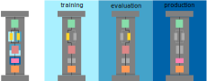

7. Pipelines
============

One of the primary goals of pyadlml is enabling users to develop production-ready 
models for `Activity Assistant`_. This necessitates a consistent procedure for 
applying transformations to both *device* and *activity* dataframes and subsequently 
forwarding the output to a classifier that estimates the different activity probabilities. 
In addition, implementing pipelines can prove advantageous since they streamlines the machine learning 
workflow, making it more consistent and reproducible, particularly
when combined with cross-validation or hyperparameter sweeps.

Sklearn pipeline's functionality falls short in certain important aspects relevant to predicting ADL.
First, it does not offer the ability to transform :math:`y`-labels within a pipeline step, which is
necessary when using the ``LabelMatcher``. Additionally, Sklearn pipeline does not permit the 
conditional execution of steps during training, testing or in production. For instance, a pipeline step that
drops duplicates should only do so during training and not during evaluation or in production.

To address these and other limitations, pyadlml extends Sklearn's pipeline functionality by 
introducing supplementary behavior while maintaining full backward compatibility:

.. code:: python

    from pyadlml.pipeline import Pipeline
    from pyadlml.preprocessing import StateVectorEncoder, LabelMatcher
    from sklearn.classifier import DecisionTreeClassifier

     # Define preprocessing steps and a classifier as last step
    steps = [('sve': StateVectorEncoder()),
             ('le': LabelMatcher()),
             ('classifier': DecisionTreeClassifier())]

    pipe = Pipeline(steps)              # Initialize the pipeline
    pipe.fit(X, y)                      # Fit the pipeline to data
    y_pred = pipe.predict(X)            # Make predictions based on data X

    X_prime = pipe[:-1].transform(X)    # Neat way to only transform the data without applying the classifier

Transformer types
~~~~~~~~~~~~~~~~~

The classic transformer in SkLearn is designed to take data :math:`X` and labels :math:`y` as input, and 
output a transformed representation :math:`X'`. However, this approach can be limiting in certain scenarios.
For instance,  some encoders like the ``LabelMatcher`` only modify the label sequence :math:`y` given  
a device dataframe :math:`X`. Furthermore, there may be cases where users require transforming both 
activities and devices. To account for these requirements, pyadlml generalizes the concept
of a transformer to represent a logical operation between data :math:`X` and labels :math:`y`, indicating 
which input the transformation is being applied to. 

To specify the category of transformer, it must be a subclass of one of the abstract classes 
``YTransformer``, ``XOrYTransformer`` or ``XAndYTransformer``. 
If a transformer does not inherit from any of these, it is automatically assumed to be an ``XTransformer``. 
To ensure that the appropriate parameters and return values are assigned, 
the pyadlml pipeline takes into account the transformer type and adjusts its behavior accordingly.

YTransformer
^^^^^^^^^^^^

Transformers that modify the labels :math:`y` only belong to the ``YTransformer`` class. A prominent example 
is the ``LabelEncoder`` analog to the official SkLearn librarys (TODO link) with its relevant code sections 
shown below

.. code:: python

    class LabelEncoder(TransformerMixin, XAndYTransformer):
        def __init__(self, ):
            pass

        def fit_transform(self, y, X=None, **fit_params):
            """
            """
            assert y is not None            

            # ...

            return y

XOrYTransformer
^^^^^^^^^^^^^^^
A typical situation for pipelines involves applying a transformation to either one or both of the inputs.
An example of such a step is the ``DropNans`` transformer, which removes ``NaN`` values from either 
the input data or the labels if only one of these parameters is provided. However, if both arguments 
are provided, the transformer drops rows where at least one of both dataframes contain a ``NaN`` value. 
Consequently, the amount of ``NaN`` values in the output may differ depending whether both
parameters were provided or just one of them. An ``XOrYTransformer`` example implementation is given by

.. code:: python

    class DropNanValues(TransformerMixin, XOrYTransformer):
        def __init__(self):
            XOrYTransformer.__init__(self)

        def fit_transform(self, X, y=None, **fit_params):
            return self.transform(X, y)

        @XOrYTransformer.x_or_y_transform
        def transform(self, X=None, y=None):
            """ Drops the time_index column
            """
            assert X is not None or Y is not None

            if X is not None and y is not None:
                mask_nans = (X.isna() | y.isna())
                X, y = X[~mask_nans].copy(), y[~mask_nans].copy()
            if X is not None:
                X = X[~X.isna()].copy()
            if y is not None:
                y = y[~y.isna()].copy()
            return X, y

.. note::

    The decorator ``@XOrYTransformer.x_or_y_transform`` ensures that the appropriate 
    number of arguments are returned given its parameters :math:`X` and :math:`y`. For 
    example, if only a single input :math:`X` is passed, the function returns
    only the single transformed output :math:`X'`.

XAndYTransformer
^^^^^^^^^^^^^^^^

Finally, the ``XAndYTransformer`` is a transformer that always requires both the input data :math:`X` 
and the corresponding labels :math:`y` to be provided as arguments. 
An important example is the ``LabelMatcher``, that depends on the devices to create the 
activity sequence. The signature for this transformer is given below

.. code:: python

    class LabelMatcher(ransformerMixin, XAndYTransformer):
        def __init__(self, other=True):
            pass

        def fit_transform(self, df_activities, df_devices):
            # ... Generate labels y_prime  and transform it conditioned on X
            return X, y

Pipeline modes and wrapper
~~~~~~~~~~~~~~~~~~~~~~~~~~

!!! DISCLAIMER !!!!
under construction

Pyadlmls pipeline can operate in three distinct modes, namely *training*, *evaluation* and *production*.
To switch between these modes, the user needs to call the corresponding method ``train()``, ``eval()`` or ``prod()``.
By default, a pipeline operates in the *training* mode.

.. code:: python

    pipe = Pipeline(steps)
    pipe.train()
    # do train stuff ...

    pipe.eval()
    # do eval stuff ...

    pipe.prod()
    # do production stuff ...

To execute steps conditionally on the three modes, the pipeline is sensitive to specific wrapper classes,
such as the ``TrainOnlyWrapper``, ``EvalOnlyWrapper`` and ``TrainOrEvalOnlyWrapper``. Wrapping a 
pipeline step using any of these classes ensures that the encapsulated transformation is only applied in the 
specified modes, when ``fit_transform``, ``transform`` or ``predict`` are called.
It is worth noting that calling ``transform`` or ``predict`` on the wrapper directly invokes the 
corresponding methods of the encapsulated step.

The following example defines a pipeline where the ``LabelMatcher`` is only executed when the pipeline
is in *training* or in *evaluation* mode. Additionally, the pipline drops duplicate values 
only during *training* mode but not in *evaluation* or in *production* mode.

.. code:: python

    from pyadlml.pipeline import Pipeline, TrainOnlyWrapper, TrainOrEvalOnlyWrapper
    from pyadlml.preprocessing import DropTimeIndex, DropDuplicates
    from pyadlml.model_selection import train_test_split
    from pyadlml.datasets import fetch_amsterdam

    # Fetch data and split into training and testing
    data = fetch_amsterdam()
    X_test, y_test, X_train, y_train = train_test_split(data['devices'], data['activities'])

    # Define pipeline steps
    steps = [
        ('sve', StateVectorEncoder(encode='raw')),
        ('le', TrainOrEvalOnlyWrapper(LabelMatcher(other=True))),
        ('drop_time_idx', DropTimeIndex()),
        ('drop_duplicates', TrainOnlyWrapper(DropDuplicates())),
        ('clf', DecisionTreeClassifier(random_state=42))
    ]

    pipe = Pipeline(steps).train()      # Create pipeline and set the pipeline into training mode
    pipe.fit(X_train, y_train)          # Fit the pipeline to the training data
    pipe = pipe.eval()                  # Set pipeline into eval mode
    score = pipe.score(X_test, y_test)  # Score pipeline on the test set
    print('score of the single  pipeline: {:.3f}'.format(score))

.. note::

    To perform hyperparameter sweeps, the transformers parameters within a wrapper must be specified. Typically,
    parameters are accessed by the step's name followed by two underscores 
    and the transformers parameter's name (e.g ``lbl__other``). However, when working with wrapped estimators, 
    the parameters must be set by including a ``__w__`` between the step's name and the parameter name. 
    The following example demonstrates how to set the ``other`` parameter within a ``TrainOrEvalOnlyWrapper``.

    .. code::

        # Classical way to access the steps estimators parameter
        steps = [ ..., ('lbl', LabelMatcher(other=True)), ...]
        param_dict = {
            'lbl__other' : [True, False]
        }

        # Access a wrapped objects parameter
        steps = [ ..., ('lbl', TrainOrEvalOnlyWrapper(LabelMatcher(other=True))), ...]
        param_dict = {
            'lbl__w__other' : [True, False]
        }

        cvs = CVGridsearch(..., param_dict=param_dict)

Pyadlml provides a rich set of transformers, which can be readily applied to a variety of tasks.
To learn about the complete list of available transformers please refer to the api (TODO link)

Feature Union
~~~~~~~~~~~~~

Pyadlml extends scikit-learns ``FeatureUnion`` class to fully leverage the pipelines functionality. 
Within a pipeline, the Feature Union step processes input data by applying multiple transformers 
in parallel and concatenating their outputs as columns.

.. raw:: html
   :file: ../_static/pipeline_feature_union_example.html

Scikit-learn's original FeatureUnion implementation lacks the ability to 
concatenate pandas dataframes. To address this limitation, pyadlml extends 
the ``FeatureUnion`` to support this functionality. The following example demonstrates
the use of a pipeline containing a ``FeatureUnion`` to extract temporal information from 
the events timestmaps:

.. code:: python

    from pyadlml.feature_extraction import DayOfWeek, TimeOfDay, InterEventTime
    from pyadlml.preprocessing import IdentityTransformer

    feature_extraction = FeatureUnion(
        [('day_of_week', DayOfWeek(one_hot_encoding=True)),  
         ('time_of_day', TimeOfDay(one_hot_encoding=True)),
         ('iei', InterEventTime()),
         ('passthrough', IdentityTransformer())])

    steps = [
        ('enc', StateVectorEncoder()),
        ('lbls', TrainOrEvalOnlyWrapper(LabelMatcher())),
        ('f_extract', feature_extraction),
        ('drop_time', DropTimeIndex()),
        ('drop_dups', TrainOnlyWrapper(DropDuplicates())),
        ('cls', RandomForestClassifier(random_state=42))
    ]

In pyadlml, the configuration of a ``FeatureUnion``'s parameters for cross-validation and 
hyperparameter optimization is similar to the conventional syntax in scikit-learn. 
Additionally, pyadlml provides a parameter to exclude an entire parallel forward pass during 
a pipeline's transform.

.. code:: python

    param_dict = { ...,
            'f_extract__time_of_day__dt' : ['2h', '3h'],
            'f_extract__skip_day_of_week' : [True, False],
            ...,
    }

.. _Activity Assistant: https://github.com/tcsvn/activity-assistant
