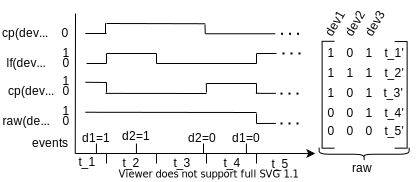

Timeseries representations
**************************

.. image:: ../_static/images/reps/representations.svg
   :height: 275px
   :scale: 100%
   :alt: alternate text
   :align: center

All Smart Home devices combined produce an irregular event sequence, where one event is a point
in time at which a device changes it's value. The device dataframe *df_devices* captures this notion, however note
that an event can also be an encoded state-vector. Many machine learning models implicitly assume different
data structures. Pyadlml offers methods to produce i.i.d, sequential, grid as well as continuous
event data. The following sections list all representations and weight their pros and cons.

I.i.d
=====

.. figure:: ../_static/images/reps/rep_iid.svg
   :height: 100px
   :align: right
   :figwidth: 20%

The most common assumption in machine learning is that
data is identical and independently distributed. Identical means that observations
are produced from the same generating process, the activities of a smart home inhabitant.
Independently means that each data point is independent of any other
datapoint. Thus the data is a set of :math:`N` datapoints such that

.. math::
    X = \{x_1 ,..., x_N \}

The following example shows a typically workflow, when using a model that
presumes the data to be i.i.d

.. code:: python

    from pyadlml.preprocessing import StateVectorEncoder, LabelEncoder
    from pyadlml.dataset import fetch_aras
    from sklearn.utils import shuffle

    data = fetch_aras()
    raw = StateVectorEncoder(encode='raw').fit_transform(data.df_devices)

    y = LabelEncoder().fit_transform(data.df_activities, raw).values
    X = raw.values

    # shuffle the data as the StateVectorEncoder returns an ordered list
    X, y = shuffle(X, y, random_state=0)

    # drop duplicates TODO nor required for fi.i.d data
    X = sklearn.drop_duplicates

    # now the data is i.i.d
    X,y

Note that :math:`X` under the i.i.d assumption disregards the inter event times as well as the time
an event happens. The latter is important as some activities are more likely
during certain times e.g having dinner in the evening. Pyadlml offers methods in
the `pyadlml.feature_extraction` module to make use of these features

.. code:: python

    from pyadlml.feature_extraction import TimeDiffExtractor, TimeOfDayExtractor

    raw = StateVectorEncoder(encode='raw').fit_transform(data.df_devices) # create state vectors

    # add a dataframe column that includes the time differences to the predecessor
    raw = TimeDiffExtractor(direction='to_predecessor', inline=True).fit_transform(raw)

    # add columns to the dataframe that represent a one-hot-encoding
    raw = TimeOfDayExtractor(t_res='2h', inline=True).fit_transform(raw)

    X = raw.values

Note that although the above example includes the time between event triggers as well as the time
an event was triggered, models assuming the data to be i.i.d per definition are not able to capture temporal
relationship between activities. ADLs are thought of as the
generating process behind the observations and are temporal interrelated. For example
the order in which activities are performed is invariant with respect to time. An inhabitant is very likely
to sleep after brushing teeth, but the point in time at which the teeth are brushed and he goes to bed can vary a lot.
A model presented with i.i.d data may correlate certain times of a day with certain activities but
will fail to capture this temporal relationship between activities. Furthermore increasing TimeOfDayExtractor's
resolution increases the number of features which may hinder the models capability to generalize.
These limitation motivate the use of sequential representations.

For a full example of a models that uses i.i.d data visit link. There are also various notebooks(links).

Sequential
==========

.. figure:: ../_static/images/reps/rep_sequential.svg
   :height: 100px
   :align: right
   :figwidth: 20%

Data is in the form of an ordered list

.. math::
    X = [x_1, ..., x_N]

Transforming the data into one of the representations *raw*, *changepoint* or *last_fired* usually yields the
datapoints already being ordered. There is no change in loading the dataset assuming a sequential format.

.. code:: python

    from pyadlml.preprocessing import DiscreteEncoder, LabelEncoder

    raw = DiscreteEncoder(rep='raw').fit_transform(data.df_devices)
    lbls = LabelEncoder(raw).fit_transform(data.df_activities)

    y = lbls.values
    X = raw.values

The drawback using only an ordered event list is neglecting the time passed between consecutive
event triggers. One way to account for this is to discretize time and assigning binary state
vectors to timeslices rather than to events.

References for models that use i.i.d data
- TODO link to userguide example
- TODO link to notebooks

Timeslice
=========

.. figure:: ../_static/images/reps/rep_timeslice.svg
   :height: 100px
   :align: right
   :figwidth: 40%

From the first unto the last event, the data is divided into :math:`M` equal-length timeslices. Each timeslice is
assigned a state vector.

.. math::
    X = \{x_1 ,..., x_M \}

How the vectors are assigned differs for each representation. For the *raw*
representation a timeslices binary vector entry is assigned either the last known device state or
the current device state of an event that falls into the timeslice. If multiple events originating from
the same device fall into the same timeslice, the most prominent state is assumed and the succeeding
timeslice is set to the last known event state. The *changepoint* representation sets a field to 1 if at
least one event of the specific device falls into the timeslice. The *last fired* representation TODO
look up.

The timeslices can be created by passing a resolution ``t_res='freq'`` to the DiscreteEncoder. Here is
an example for the *raw* representation with a timeslice-length of 10 seconds.

.. code:: python

    from pyadlml.preprocessing import DiscreteEncoder, LabelEncoder

    raw = DiscreteEncoder(rep='raw', t_res='10s').fit_transform(data.df_devices)
    labels = LabelEncoder(raw).fit_transform(data.df_activities)

    X = raw.values
    y = labels.values

.. Note::
    The drawback using timeslices as data representation is a trade-off originating in the choice of
    timeslice resolution. The greater the timeslice-length the higher the probability multiple events
    fall into the same timeslice, leading to a higher information loss. Smaller timeslice-length lead to
    a higher dataset size, which can lead to problems when learning the parameters of some models. Looking
    at you HSMM :/. If a model is used in a real-time context the time for performing inference
    must not exceed the timeslice-length to ensure reliable predictions.

References for models that use timesliced data
- TODO link to userguide example
- TODO link to notebooks

Temporal points
===============

TODO include description
- add link to pyhawkes

Further transformations
=======================

Based on the different representations further transformations can be done. Sequence models like LSTMs need
to have batches of samples. With the rise of machine learning models that are good at recognizing images it can
be reasonable to represent a timeseries as an image in order to make use of these models capabilities.

.. code:: python
    from pyadlml.preprocessing import ImageEncoder, ImageLabelEncoder
    from pyadlml.model_selection import

    img_enc = ImageEncoder(rep='raw', t_res='10s', window_length='30s')
    raw_img = img_enc.fit_transform(data.df_devices)
    labels = ImageLabelEncoder(raw_img, data.df_activities)

.. image:: ../_static/images/reps/image.svg
   :height: 200px
   :width: 500 px
   :scale: 80%
   :alt: alternate text
   :align: center

The image is being generated by sliding a window over the sequential data. For each image the
corresponding activity is that of the images last timestamp. *Raw*, *changepoint* and *last_fired* representation
can be transformed into images.

.. code:: python

    from pyadlml.preprocessing import ImageEncoder, ImageLabelEncoder

    img_enc = ImageEncoder(rep='raw', t_res='10s', window_length='30s')
    raw_img = img_enc.fit_transform(data.df_devices)

    labels = ImageLabelEncoder(raw_img, data.df_activities)

    X = raw.values
    y = labels.values
