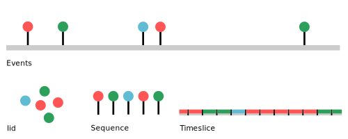
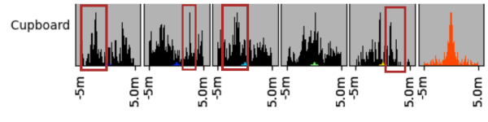
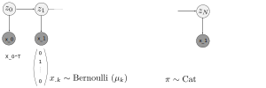
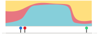
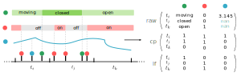
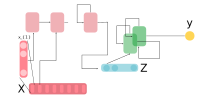
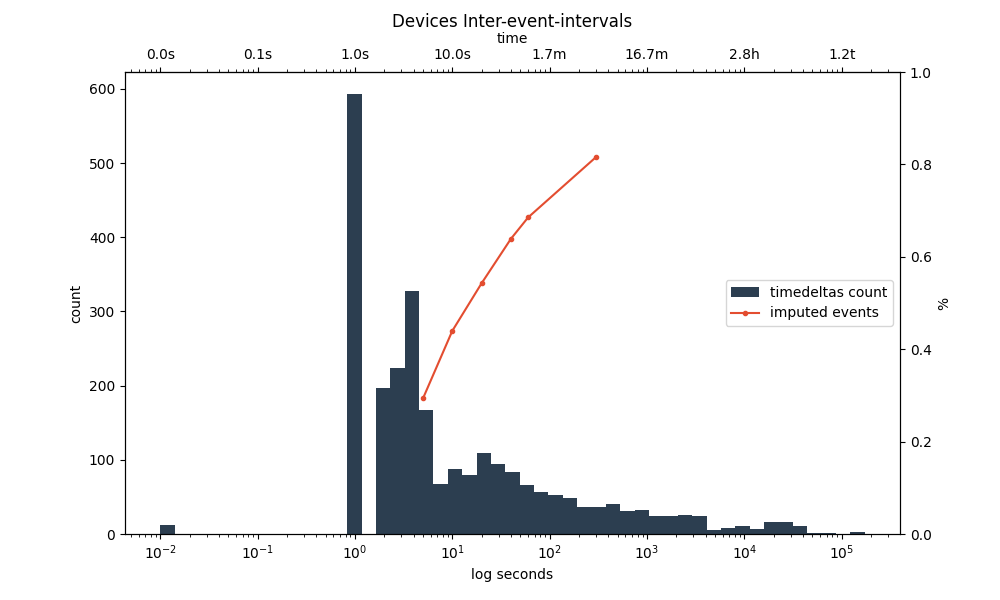

7. Timeseries representations
*****************************

Many Smart Home devices combined produce an irregular event sequence. An event is a point
in time where a device changes it's value. Many machine learning models make implicit assumption on how
data is structured. To enable applying a wide range of models, pyadlml can transform data to be used as iid,
ordered, binned or continuous time format. The following sections cover each representation,
give an informal example and close with a discussion on the respective dis/advantages.

I.i.d
=====

Definition
~~~~~~~~~~

The most common assumption in machine learning is the
data being identical and independently distributed. Identical means that observations
are produced from the same generating process. Independence requires that each data point
is generated independently of any other datapoint. Note that this is usually violated, because
device activations are temporally and spatially correlated.

Example: Random Forest
~~~~~~~~~~~~~~~~~~~~~~

The following example illustrates how to build a typical pipeline,using a RandomForest that
presumes the data to be I.i.d.

.. code:: python

    from pyadlml.preprocessing import Event2Vec, LabelEncoder
    from pyadlml.dataset import fetch_aras
    from pyadlml.pipeline import Pipeline
    from sklearn.utils import shuffle
    from sklearn.classifiers import RandomForest

    data = fetch_aras()

    # select a random day for the test set
    # also return the previous values each device had before the test day
    #   in order to build a correct state-vector during predictions
    X_train, y_train, X_test, y_test, y_pre_values = \
        train_test_split(data, strategy='leave_one_day_out', return_dev_vals=True)

    # define pipeline
    steps = [
        ('sve', Event2Vec(encode='state')),      # encode device dataframe into state vectors
        ('le', LabelEncoder(idle=False)),               # generate encoded labels
        ('drop nans', ),                                # drop all rows where no matching activity was found
        ('cast',),                                      # cast the activities from numpy to a dataframe
        ('upsample', ),                                 # upsample the activities to get an equal distribution
        ('classifier', RandomForestClassifier())        # apply classifier to data
    ]
    pipe = Pipeline(steps).train()

    # train the pipe
    pipe.fit(X_train, y_train)

    # score pipeline
    pipe.eval()
    score = pipe.score(X_test, y_test, {'sve__y_pre_values' : y_pre_values})

Discussion
~~~~~~~~~~

There are two particular dstatebacks presupposing the data to be iid:

- Datapoints are in fact not independent of each other. As shown in the cross-correlogram below, certain events are preceded by others with a regular pattern. For example, the cupboard opening or closing is often followed by operating the microwave three minutes after. Although it holds that temporal structure does not strictly imply the observations to be dependent, in the real world they most often are. Models assuming independence may miss out on useful information.

- Activities of daily living posses an intrinsic temporal structure. The order in which activities occur is equivariant. For example, an inhabitant may be very likely to go to sleep after brushing his teeth. However, the point in time when he starts brushing his teeth can vary from day to day but is always followed by the activity sleep. Models without a memory of the preceding activities are not able to learn the activities order.

These limitations or missed opportunities may negatively impact the prediction accuracy and
thus motivate the use of models that take advantage of a sequential representation.

Ordered
=======

Definition
~~~~~~~~~~

Datapoints are an ordered list containing :math:`N` observations :math:`X = [x_1, ..., x_N]`. Transforming a device
dataframe into the representations *state*, *changepoint* or *last_fired* yields the datapoints already being ordered.
Consequently, the usage is straight forward.

Example: Hidden Markov Model
~~~~~~~~~~~~~~~~~~~~~~~~~~~~

A Hidden Markov Model (HMM) is a generative machine learning model. An unobserved markov
process represented by the hidden states  generates the observations :math:`X`.
The probability of each state depends only on the state attained in the previous state. The observation sequence
:math:`X` follows a multivariate Bernoulli distribution, binary vectors corresponding to Smart Home states. In this case
we assume that the activity labels are the same as the hidden states :math:`Y=Z`.
In other words, there is an activity sequence e.g ( 'dinner'->'brushing_teeth'->'going_to_bed'-> ...) where
each activity state has an own probability distribution over the observations. For example the state
'breakfast' could have a Bernoulli distributions where devices in the kitchen are very likely to be one and devices
elsewhere zero. A graphical representation  given below

Learning can be done by a maximum a-posteriori point estimate (MAP), as there are no unobserved states given the supervised
sequence :math:`Z` and the observations :math:`X`. In simpler terms this is counting how often a person
performs a certain activity and within that activity how often are devices/features on versus off. Furthermore the
transition probability :math:`p(z_{t+1} \mid z_t)` between activities is estimated by just counting how often
one activity is followed by another. There is no magic happening there. Pyadlml contains a implementation of a
`BernoulliHMM` that if given an additional hidden-state-sequence produces the MAP-estimate:

.. code:: python

    from pyadlml.preprocessing import Event2Vec, LabelEncoder
    from pyadlml.dataset import fetch_aras
    from pyadlml.pipeline import Pipeline
    from pyadlml.models import BernoulliHMM

    # select a random day for the test set
    # also return the previous values each device had before the test day
    #   in order to build a correct state-vector during predictions
    data = fetch_aras()
    X_train, y_train, X_test, y_test, y_pre_values = \
        train_test_split(data, strategy='leave_one_day_out', return_dev_vals=True)

    # define pipeline
    steps = [
        ('sve', Event2Vec(encode='state')),      # encode device dataframe into state vectors
        ('le', LabelEncoder(other=True)),                # generate encoded labels
        ('cast', DfCaster('df->np', 'df->np')),         # cast labels and state representation to numpy arrays
        ('classifier', BernoulliHMM())                  # apply classifier to data
    ]
    pipe = Pipeline(steps).train()

    # train the pipe
    pipe.fit(X_train, y_train)

    # score pipeline
    pipe.eval()
    score = pipe.score(X_test, y_test, {'sve__y_pre_values' : y_pre_values})

Discussion
~~~~~~~~~~

The i.i.d and sequential representation only allow for predicting labels at times when events occur.
However it is reasonable to predict activities between events as the probability for one specific
activity may decrease with the amount of time the activity is being performed, regardless of occurring device
events.

As illustrated in the above example, the probability for e.g *brushing_teeth* is very likely to be
small 5 minutes after initiation although no new event is triggered.
This motivates the timeslice as well as the temporal point representation, where activities
are predicted at a regular interval.

Timeslice
=========

Definition
~~~~~~~~~~

From the first unto the last event, the data is divided into :math:`M` equal-length bins. A bin
is referred to as a timeslice. A state-vector is assigned to each timeslice :math:`X = [x_1 ,..., x_M]`.
The *state* representation tries to assign each timeslice a representative value of the Smart Homes state.
The *changepoint* representation sets fields to one if at least one corresponding event falls
into the timeslice's interval.
The *last_fired* representation assigns one to fields corresponding to the device that fired last with respect
to the timeslices right boundary.

Merging values
~~~~~~~~~~~~~~

When discretizing the event stream gaps where no events occur and collisions where multiple events fall into the scope
of the same timeslice have to be handled. Device values are imputed and merged differently for each representation.

The state representation handles gaps by assigning an entry the last known device state. Numerical values have to
be handled explicitly as only categorical and binary values are inferred automatically. For the
changepoint representation gaps are per definition zero. The *lastfired* representation sets every
field to zero except for the device that was responsible for the last event. These properties
are illustrated for the timeslice :math:`t_3` above.

If multiple events originating from the same device fall into the same timeslice, the *state*
representation sets the timeslice to the most prominent state and the succeeding timeslice
to the last known device state.

.. code:: python

    >>> from pyadlml.dataset import fetch_aras
    >>> from pyadlml.preprocessing import Event2Vec

    >>> data = fetch_aras()
    >>> print(len(data.df_devices))
    (24000, )

    >>> X = Event2Vec(encoding='changepoint', dt='10s').fit_transform(data.df_devices)
    >>> print(len(X))
    (1230000, )

Example: Recurrent Neural Net
~~~~~~~~~~~~~~~~~~~~~~~~~~~~~

The encoder-decoder recurrent neural network

Timeslices can be constructed by passing the parameter resolution ``t_res='freq'`` to the Event2Vec.
To create a *state* representation with timeslice-length of 10 seconds use

.. code:: python

    from pyadlml.model.rnn.rnn import RNN
    from pyadlml.preprocessing import

    classifier = RNNClassifier(module=RNN,
        max_epochs=50,
        batch_size=1,
        verbose=0, earch
        callbacks='disable',
        train_split=None,
        device=('cuda' if use_cuda else 'cpu'),
        criterion=torch.nn.CrossEntropyLoss,
        optimizer=torch.optim.Adam,
        module__input_size=input_size,
        module__n_classes=num_classes,
        module__seq=seq_type,
    )

    steps = [
        ('sv_enc', Event2Vec()),
        ('lbl_enc', TrainOrEvalOnlyWrapper(LabelEncoder(idle=True))),
        ('select_train', TrainOnlyWrapper(CVSubset())),
        ('select_val', EvalOnlyWrapper(CVSubset())),
        ('drop_time', DropTimeIndex()),
        ('df->np', DfCaster('df->np', 'df->np')),
        ('batcher', TrainOrEvalOnlyWrapper(SequenceSlicer(rep=seq_type, stride=3))),
        ('classifier', classifier),
    ]

    pipe = Pipeline(steps).train()
    classifier.fit(None, None)

    print(dir(classifier))

Discussion
~~~~~~~~~~

The dstateback using timeslices lies in a trade-off regarding the choice of
timeslice resolution. The greater the timeslice-length the higher the probability multiple events
fall into the same timeslice. Consequently larger timeslices lead to higher information loss
as more events have to be merged. To visualize the number of events prone to merging use the inter-event interval and the parameter ``imp_frac_dts``:

.. code:: python

    from pyadlml.plot import plot_device_inter_event_intervals
    data = fetch_amsterdam()

    plot_device_inter_event_intervals(data.df_devices, imp_frac_dts=['5s', '10s', '20s', '40s', '1min', '5min']);

The illustration shows that by choosing a timeslice size of 10 seconds already :math:`40\%` of events are merged.

On the other hand choosing a to small timeslice-length may lead to memory problems.
This is not solely reflected by the dataset size as some models may scale data in memory (e.g HSMM :math:`O(n^3)`)
during learning.

Furthermore there is a lower limit to the timeslice length when models are trained that
are deployed in production. The time a model takes for one prediction must not exceed the timeslice
length in order for the system to keep up.

Temporal points
===============

There are two use-cases when using this representation. The model is
responsible for using the time between events to evolve itsself forward.
This case concerns itsself where activities have to be predicted during.

Example: Neural Ordinary Differential Equation
~~~~~~~~~~~~~~~~~~~~~~~~~~~~~~~~~~~~~~~~~~~~~~
The following example shows three binary devices and their corresponding timeslice representation as a function
of different vector encodings.

.. code:: python

    from pyadlml.dataset import fetch_amsterdam
    from pyadlml.models import NODE
    from pyadlml.preprocessing import Event2Vec

    data = fetch_amsterdam()
    X = .fit_transform(data.df_devices)

    steps = [('sve', Event2Vec()),
            ('le', LabelEncoder(other=True)),
            ('classifier', NODE()),
        ]

    pipe = Pipeline(steps)
    pipe.fit()

    pipe.score()
