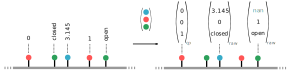
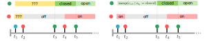
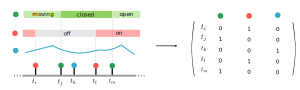
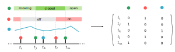

4. Device encoding
******************

The device datastream comes in the form of events :math:`e_{i}=(t_i, d_i, o_i)` in a sequence :math:`e_i \in [1,T]`.
An event :math:`e_i` consists of a device :math:`d_i` that produces observation :math:`o_i` at time :math:`t_i`.
Different algorithms require specific formats, therefore paydlml supports multiple Encoder based in the librayr
``pyadlml.preprocessing``.

In general, first a The overall procedure to generate encoded data and correct labels, is transforming the device dataframe into a
specific representation using some ``[Specific]Encoder`` and labeling the new representation by the recorded activities
(``LabelMatcher``) afterwards.

.. code:: python

    from pyadlml.preprocessing import LabelMatcher, SpecificEncoder

    enc = SpecificEncoder(*args, **kwargs)
    X_enc = enc.fit_transform(data['devices'])

    lm = LabelMatcher(*args, **kwargs)
    y_enc = lm.fit_transform(data['activities'], X_enc)

    X = X_enc.values
    y = y_enc.values

Index
^^^^^

This encoder is most often used to index lookup embeddings in neural networks.

StateVector
^^^^^^^^^^^
Pyadlml supports three different types of state-vectors, the *raw*, *changepoint* and *lastfired*
encoding.

Raw
~~~

Definition
==========

.. image:: ../_static/images/encodings/raw.svg
   :height: 90px
   :width: 300 px
   :scale: 200 %
   :alt: alternate text
   :align: center

The *raw* representation consists of a vector describing a Smart Home's state at that given point in time.
Each vector field corresponds to the state a specific device is in at that given moment. This is shown exemplary for
three different binary devices in the illustration above. In addition to binary values pyadlml also supports numerical as well as categorical
values

.. math::
    x_t = \begin{bmatrix} 1 & 0 & -1.348 & \text{ open } & ... & 1\end{bmatrix}^T \\
    \text{ where } x_{tk} \in \{\{0,1\} \cup \mathbb{R} \cup \text{Categorical}\}

Example
=======

To transform a device dataframe to the *raw* representation and generate correct corresponding labels,
use the *StateVectorEncoder* ``encode=raw`` parameter

.. code:: python

    >>> from pyadlml.preprocessing import StateVectorEncoder, LabelEncoder

    >>> raw = StateVectorEncoder(encode='raw').fit_transform(data.df_devices)
    >>> labels = LabelEncoder().fit_transform(data.df_activities, raw)

    >>> print(raw.head())
    ... TODO
    >>> print(labels.head())
    ... TODO

Unknown values
==============

When encoding state-vectors device values from previous events are used to fill in the vector-fields for all devices
except the device that fired. Events that precede the timepoint at which a certain device fires for the first time have to infer the
devices value for those events.

In the binary case correct values can be inferred by simply inverting
the first occurring value. For categorical values the *StateVectorEncoder* still yields the most likely state-vectors,
where the preceding category is calculated as the most probable category given the first known succeding category :math:`p(c_{<t}|c_t)`. 
Numerical values within a state-vector at time-points where the device does
not emit observations are filled with ``NaN``'s. 

To ensure working with correct values only, retrieve the timestamp
where all devices fired at least once and use the dataframe from that point forward

.. code:: python

    raw = StateVectorEncoder(encode='raw').fit_transform(data.df_devices)

    # get time string of last device that fired for the first time
    timestr = TODO

    # select all values after the device
    raw = raw[raw['time'] > timestr]

Changepoint
~~~~~~~~~~~

Definition
==========

The changepoint representation one-hot encodes all devices indicating the device that generated the event.
A vector-field  possesses the value one at timepoint :math:`t` if and only if the device is responsible for producing
the current event, otherwise all device fields are set to zero.

.. math::
    x_t = \begin{bmatrix} 0 & 1  & ... & 0 \end{bmatrix}^T \text{ where } x_{tk} \in \{0,1\}

For e.g binary devices the field is 1, when the state changes from
1 to 0 or from 0 to 1. The changepoint representation tries to capture the notion that solely the device trigger, rather than
the triggering devices content, conveys useful information.

Example
=======

Load the changepoint representation by using the ``encode='changepoint'`` argument.

.. code:: python

    from pyadlml.preprocessing import StateVectorEncoder, LabelEncoder

    cp = StateVectorEncoder(encode='changepoint').fit_transform(data.df_devices)
    labels = LabelEncoder().fit_transform(data.df_activities, cp)

    X = cp.values
    y = labels.values

LastFired
~~~~~~~~~

Definition
==========

The *last_fired* representation is a device one-hot-encoding, indicating the device that fired last. Each field
in the vector corresponds to a device. A field possesses the value one at timepoint :math:`t`, if and only if the device
was the last to change its state. Otherwise all fields assume the state zero.

.. math::
    x_t = \begin{bmatrix} 0 & 1  & ... & 0 \end{bmatrix}^T \text{ where } x_{tk} \in \{0,1\}

.. note::
    If the data is not up- or downsampled the *last_fired* representation is the same as the *changepoint* representation.

Example
=======
To transform a device dataframe into the *last_fired* representation use the ``encode='last_fired'`` argument

.. code:: python

    from pyadlml.preprocessing import DiscreteEncoder, LabelEncoder

    raw = DiscreteEncoder(encode='last_fired').fit_transform(data.df_devices)
    labels = LabelEncoder(raw).fit_transform(data.df_activities)

    X = raw.values
    y = labels.values

Combining Encodings
~~~~~~~~~~~~~~~~~~~

In most cases it is reasonable to combine different encodings, e.g the *raw* representation and the *last_fired* representation.
Concatenate the different encodings string representations with a ``+`` operator and pass the string to the encode parameter.
The following code is an example of combining the *raw* and the *last_fired* encoding:

.. code:: python

    X = StateVectorEncoder(encode='raw+last_fired')\
        .fit_transform(data.df_devices)\
        .values
