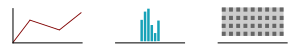
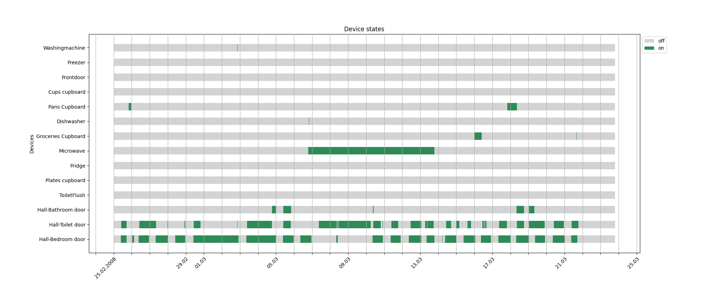
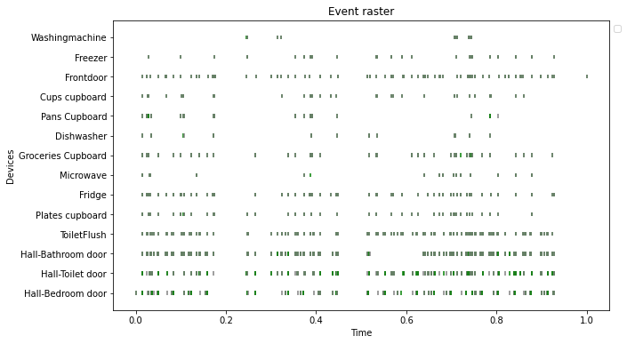
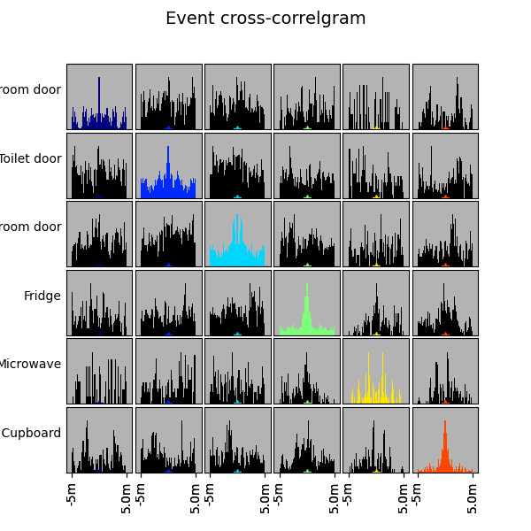
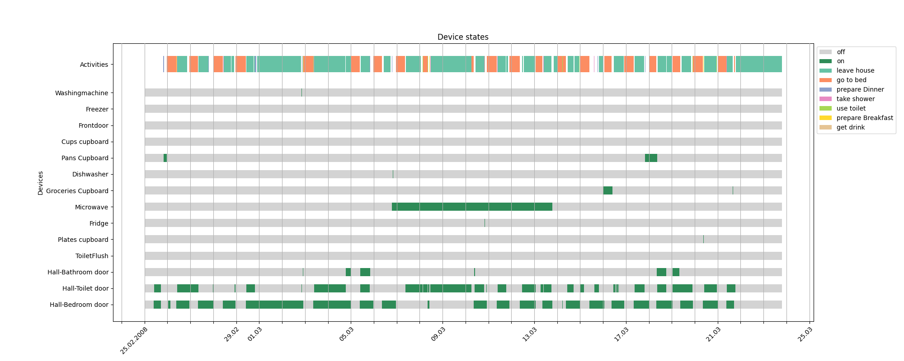
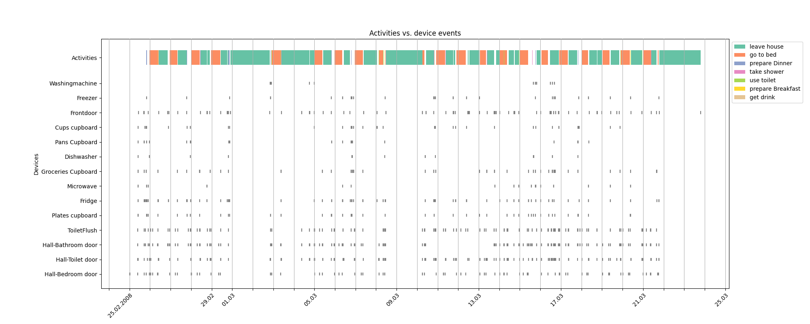
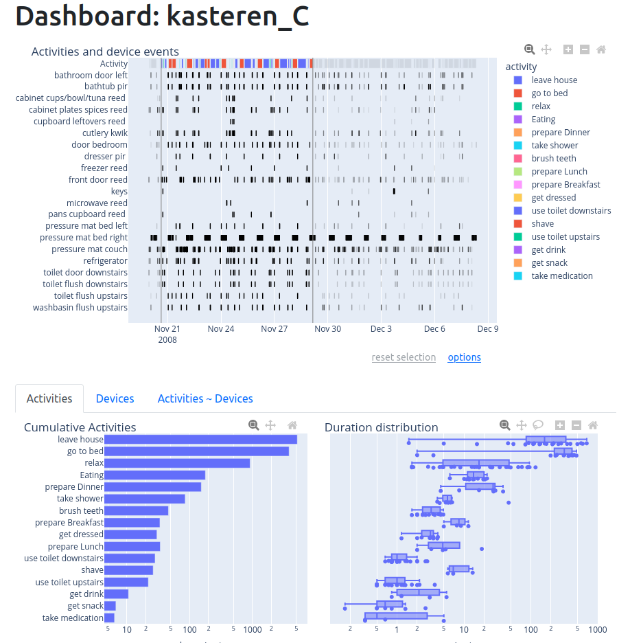

3. Statistics and Visualization
*******************************

To successfully adapt machine learning models, understanding a datasets structure 
and assessing its quality is essential. Pyadlml provides several methods for calculating
and visualizing dataset statistics. Since most graphs correspond to a particular statistic, 
the following sections lists them jointly. Visualizations that have an interactive version 
contain a link to the respective function. Additionally, pyadlml ships a dashboard 
that offers users efficient and interactive data exploration.

Methods for computing statistics are imported from ``pyadlml.stats``, generating plots 
from ``pyadlml.plot`` and interactive plots from the ``pyadlml.plotly`` module. 
To use the dashboard, clone the github repository and execute the respective file 
in the example folder.The :ref:`amsterdam <Amsterdam>` dataset is used for all the following examples.

.. code:: python

    >>> from pyadlml.dataset import fetch_amsterdam
    >>> data = fetch_amsterdam()
    >>> df_devices, df_activities = data['devices'], data['activities']

Activities
==========

Count
~~~~~

Get the total count a person performed a specific activity with

.. code:: python

    >>> from pyadlml.stats import activity_count
    >>> activity_count(df_activities)
                activity  occurrence
    0          get drink         19
    1          go to bed         47
    2        leave house         33
    3  prepare Breakfast         19
    4     prepare Dinner         12
    5        take shower         22
    6         use toilet        111

    >>> from pyadlml.plot import plot_activity_bar_count
    >>> plot_activity_bar_count(df_activities, other=True);

.. image:: ../_static/images/plots/act_bar_cnt.png
   :height: 300px
   :width: 500 px
   :scale: 90 %
   :alt: alternate text
   :align: center

.. Note::
    In nearly every dataset, gaps exist between activities where device readings are
    recorded, but a corresponding activity label is missing. To maintain a cohesive
    sequence, the *other* activity can be used to fill the activity gaps [#f1]_. To include
    the *other* activity in the statistics pass the parameter ``other=True`` to the respective method.

Duration
~~~~~~~~

Compute the total time an inhabitant spent performing an activity with:

.. code:: python

    >>> from pyadlml.stats import activity_duration
    >>> activity_duration(df_activities)
                activity       minutes
    0          get drink     16.700000
    1          go to bed  11070.166267
    2        leave house  22169.883333
    3  prepare Breakfast     63.500000
    4     prepare Dinner    338.899967
    5        take shower    209.566667
    6         use toilet    195.249567

    >>> from pyadlml.plots import plot_activity_bar_duration
    >>> plot_activity_bar_duration(df_activities)

.. image:: ../_static/images/plots/act_bar_dur.png
   :height: 300px
   :width: 500 px
   :scale: 90 %
   :alt: alternate text
   :align: center

or use a boxplot to obtain information about the activities distribution

.. code:: python

    from pyadlml.plots import plot_devices_bp_duration

    plot_devices_bp_duration(df_activities)

.. image:: ../_static/images/plots/act_bp.png
   :height: 300px
   :width: 500 px
   :scale: 90 %
   :alt: alternate text
   :align: center

Note, the inhabitant seems to sleep on average :math:`3` hours. This activity duration appears to be rather short.
However, the transition matrix below reveals the activity *going to bed* is often followed by *using toilet*
and vice versa. Consequently the mistery is solved.

Transition
~~~~~~~~~~

Compute a transition matrix that displays how often one activity is followed
by another

.. code:: python

    >>> from pyadlml.stats import activity_transition

    >>> activity_transition(df_activities)
    act_after          get drink  go to bed  ...  use toilet
    activity
    get drink                  3          0  ...          15
    go to bed                  0          0  ...          43
    leave house                3          1  ...          22
    prepare Breakfast          1          0  ...           8
    prepare Dinner             7          0  ...           4
    take shower                0          0  ...           1
    use toilet                 5         46  ...          18

A matrices entry :math:`c_{ij}` represents how often activity :math:`i` is followed
by activity :math:`j`.
In the above example the inhabitant visits the toilet 43 times after he goes to bed.
The matrix can also be visualized as a heatmap:

.. code:: python

    from pyadlml.plots import plot_activity_hm_transitions

    plot_activity_hm_transitions(df_activities)

.. image:: ../_static/images/plots/act_hm_trans.png
   :height: 300px
   :width: 500 px
   :scale: 90 %
   :alt: alternate text
   :align: center

Density
~~~~~~~

Different activities are more probable during certain times of the day. For example the
activity *breakfast* is more likely to be performed in the morning whereas the activity *going
to bed* usually occurs in the evening. Pyadlml offers a way to approximate the activity density
over one day with monte-carlo sampling:

.. code:: python

    >>> from pyadlml.stats import activities_dist
    >>> activities_dist(df_activities, n=1000)
             prepare Dinner           get drink ...         leave house
    0   1990-01-01 18:12:39 1990-01-01 21:14:07 ... 1990-01-01 13:30:33
    1   1990-01-01 20:15:14 1990-01-01 20:23:31 ... 1990-01-01 12:03:13
    ..                      ...                 ...                 ...
    999 1990-01-01 18:16:27 1990-01-01 08:49:38 ... 1990-01-01 16:18:25

    >>> from pyadlml.plots import plot_activity_ridgeline
    >>> plot_activity_ridgeline(df_activities)

.. image:: ../_static/images/plots/act_ridge_line.png
   :height: 300px
   :width: 500 px
   :scale: 90 %
   :alt: alternate text
   :align: center

Devices
=======

In a Smart Home environment, device recordings can be viewed from two different perspectives.
One perpective involves examining the states of all binary, categorical and numerical devices
at a specific point in time, referred to as the *state* view. The other perspective only focuses
on the timing of device activations, which collectively produce the event stream. It is worth
noting that the event view is similar to the concept of spike trains studied in neuroscience.
Pyadlml applies techniques from spike train analysis to provide insights on Smart Home device events.

States
~~~~~~

To obtain overview of all device states during an experimental period, use

.. code:: python

    >>> from pyadlml.plots import plot_device_states
    >>> plot_device_states(df_devices)

.. warning::
    When using Matplotlib to render the vertical bars representing device states, 
    the resolution of the plot may affect the visibility of certain states. 
    If a device adopts a state for a duration shorter than the minimum depictable step,
    that state will not be visible in the plot. Consequently, the absence of certain device states 
    in a plot do not necessarily imply that the device never adopted those states 
    (e.g ``Plates cupboard`` , ``ToiletFlush``, ... in the above plot).
    Therefore, it is advisable to consult additional plots or statistics to gain a
    more comprehensive understanding of the device states. By selecting a smaller time-frame 
    these activations may become visible:

    .. code:: python

        >>> plot_device_states(df_devices, selected_timespan=['12.08.2008', '13.08.2008'])

Fraction
^^^^^^^^

Compute the time and fraction a device is in a certain state. Binary devices are divided
into *on* and *off* states. For categorical devices the respective categories are computed

.. code:: python

    >>> from pyadlml.stats import device_fractions
    >>> device_fractions(df_devices)
                    device                  td_on                  td_off   frac_on  frac_off
    0        Cups cupboard 0 days 00:10:13.010000 27 days 18:34:19.990000  0.000255  0.999745
    1           Dishwasher        0 days 00:55:02        27 days 17:49:31  0.001376  0.998624
    ...                ...                    ...                     ...        ...      ...
    13      Washingmachine        0 days 00:08:08        27 days 18:36:25  0.000203  0.999797

    >>> from pyadlml.plots import plot_device_state_fraction
    >>> plot_device_state_fraction(df_devices)

.. image:: ../_static/images/plots/dev_on_off.png
   :height: 300px
   :width: 500 px
   :scale: 100 %
   :alt: alternate text
   :align: center

The distribution for each state can be visualized using a boxplot and passing the respective state as parameter

.. code:: python

    from pyadlml.plots import plot_device_state_dist

    plot_device_state_dist(df_devices, binary_state='on', categorical_state=[('device', 'cat1')])

.. image:: ../_static/images/plots/dev_bp_dur.png
   :height: 300px
   :width: 500 px
   :scale: 90 %
   :alt: alternate text
   :align: center

State Cross-Correlation
^^^^^^^^^^^^^^^^^^^^^^^

To gain insight into the usefullness of devices, it may be helpful to consider the 
similarity between their states. When device states are uncorrelated, they may provide better 
basis for machine learning algorithms. To determine how much one devices state :math:`g` resembles 
another :math:`f`over time, we can compute the cross-correlation with 

.. math::
    C_{f,g}(\tau) = \frac{1}{T}\int g(t)\cdot f(t-\tau)dt  \text{ with } \tau=0, f(t),g(t)\in \{-1,1\}\\
    \text{and } f,g \text{ is Boolean } : \text{off} \rightarrow -1, \text{on} \rightarrow 1\\
    \text{and } f,g \text{ is Categorical } : \text{cat not present} \rightarrow -1, \text{cat present} \rightarrow 1

The above equation shows that the cross-correlation is a function of :math:`\tau`. By evaluating 
the function for a range of :math:`\tau`, it is possible to idengity periodic similarity and other related properties.
However, for the purpose of this method we are only interested in comparing signals at their unshifted state, so
we set the time-lag to :math:`\tau = 0`. For binary device, the state "on":math:`\rightarrow 1` and "off":math:`\rightarrow -1`.
For categorical devices, each category maps to the value :math:`1`` if present or :math:`-1` if not.
As a result, when two devices have identical device activation the correlation will be :math:`1`, while 
one activation being the inverse of the other will produce a correlation of :math:`-1`. Uncorrelated devices 
will report an average correlation of :math:`0`.

.. code:: python

    >>> from pyadlml.stats import device_duration_corr
    >>> device_duration_corr(df_devices)
    device              Cups cupboard  Dishwasher  ...  Washingmachine
    device                                         ...
    Cups cupboard            1.000000    0.997571  ...        0.999083
    Dishwasher               0.997571    1.000000  ...        0.996842
    ...
    Washingmachine           0.999083    0.996842  ...        1.000000
    [14 rows x 14 columns]

    >>> from pyadlml.plots import plot_device_cross_correlation_states
    >>> plot_device_cross_correlation_states(df_devices)

.. image:: ../_static/images/plots/dev_hm_dur_cor.png
   :height: 400px
   :width: 500 px
   :scale: 90 %
   :alt: alternate text
   :align: center

.. note::

    Note that categories for a categorical device with more than two categories, the categories are
    necessarily related to each other since only one category can be present at any given moment. Therefore,
    compare other devices to the categorical devices, rather than comparing 
    the individual categories within the device.

.. The heatmap above shows most devices are in the same state at the same time. This is not
.. surprising as most devices are *off* the whole time (TODO link). Note this does not apply to the *Microwave*,
.. that seems to be *on* a long time when other devices are *off*. However this is unlikely as a *Microwave* usually
.. is *on* only for a small amount of time. This artefact hints at a mistake in the data collection process.
.. The *Microwave* erroneous state is corrected in the data cleaning notebook (link). More on cleaned datasets
.. can be read in the (TODO link to section). This example illustrates that it is important to sanity-check the data to
.. quickly identify if something went wrong during the collection process.

Events
~~~~~~

A useful approach to view device data is to analyse the states first derivative as event trains, 
wherein only the time of the event and the responsible device are considered, 
while disregarding the generated value. Events can be characterized solely by their timestamp :math:`t^{f}` where :math:`f` enumerates the
events. Thus a spike train is defined as a sum of dirac :math:`delta`-functions:

.. math::
    E(t) = \sum_f\delta(t-t^{f})

To provide an illustration of all events that occur throughout the entire duration of the experiment use

.. code:: python

    >>> from pyadlml.plot import plot_device_event_raster
    >>> plot_device_event_raster(df_devices)

Event counts
^^^^^^^^^^^^
Compute the total amount of events produced per device

.. code:: python

    >>> from pyadlml.stats import device_trigger_count
    >>> device_trigger_count(df_devices)
                    device  trigger_count
    0        Cups cupboard             98
    1           Dishwasher             42
    ..                 ...            ...
    13      Washingmachine             34

    >>> from pyadlml.plots import plot_device_bar_count
    >>> plot_device_bar_count(df_devices)

.. image:: ../_static/images/plots/dev_bar_trigger.png
   :height: 300px
   :width: 500 px
   :scale: 90 %
   :alt: alternate text
   :align: center

Inter-event-Intervals
^^^^^^^^^^^^^^^^^^^^^
The duration between two consecutive events is referred to as the inter-event interval.
To calculate the inter-event distribution utilize

.. code:: python

    >>> from pyadlml.stats import device_time_diff

    >>> device_time_diff(df_devices)
    array([1.63000e+02, 3.30440e+04, 1.00000e+00, ..., 4.00000e+00,
           1.72412e+05, 1.00000e+00])

    >>> from pyadlml.plot import plot_device_iei

    >>> plot_device_iei(df_devices, todo=['3s', '10s'])

.. image:: ../_static/images/plots/dev_hist_trigger_td.png
   :height: 300px
   :width: 500 px
   :scale: 100 %
   :alt: alternate text
   :align: center

.. note::
    In the depicted visual, some events fall into the ~ :math:`5ms` bin. This occurences
    may be attributed to the automatic device correction, which offsets an event by that 
    specific time interval if two events originally occur simultaneously.

Event density
^^^^^^^^^^^^^

Considering that event generation is influenced by various activites and certain
activities are more likely to occur during specific times of the day, visualizing the  
cummulated event density throughout a day may provide valuable insights.
The day can be divided into discrete time intervals of length :math:`dt` with

.. code:: python

    >>> from pyadlml.stats import device_event_density_one_day
    >>> device_trigger_one_day(df_devices, dt='1h')

    device    Cups cupboard  Dishwasher   ...  Washingmachine
    time                                  ...
    00:00:00            0.0         0.0   ...             0.0
    01:00:00           16.0         0.0   ...             0.0
    ...
    23:00:00            6.0         8.0   ...             2.0

    >>> from pyadlml.plots import plot_device_event_density
    >>> plot_device_event_density(df_devices, dt='1h')

.. image:: ../_static/images/plots/dev_hm_trigger_one_day.png
   :height: 300px
   :width: 500 px
   :scale: 100 %
   :alt: alternate text
   :align: center

Cross-correlogram
^^^^^^^^^^^^^^^^^

In scenarios where event times between devices are uncorrelated, machine learning algorithms
are unable to leverage any temporal information related unobserved activities. 
To evalute the degree of synchronization between devices, a common approach is to 
calculate a cross correlogram. Consider two device event sequences represented as 
trains :math:`f` and :math:`g` where :math:`g_i` denotes the time of the :math:`i`-th event. 
By fixing an event :math:`f_i` and counting the number of events from train :math:`g` that occur 
within the temporal window :math:`\tau` centered around :math:`f_i`, a histogram
of coincidence events can be created:

.. math::
    C_{f,g}(\tau) = \sum_{i,j} 1[\mid g_j - f_i\mid \leq \tau ]_{\tau}

Peaks in the correlogram are typically regarded as indications of event time synchronization.

.. code:: python

    >>> from pyadlml.stats import device_event_cross_correlogram
    >>> from pyadlml.plot import plot_device_event_cross_correlogram

    # only select a subset in order to present an uncluttered plot
    >>> df_devs_sub = df_devs[df_devs[DEVICE].isin(['Hall-Bedroom door', 'Hall-Toilet door', 'Hall-Bathroom door', 'ToiletFlush' 'Plates cupboard', 'Fridge', 'Microwave', 'Groceries Cupboard'])]

    # returns an array of #devices #devices #bins and the bins
    >>> cc, bins = device_event_cross_correlogram(df_devs_sub, binsize='2s', max_lag='2min')
    >>> print(cc.shape, bins.shape)
    (6,6,120), (120,)

    >>> plot_device_event_cross_correlogram(df_devs_sub, binsize='2s', max_lag='2min')

Firing rate
~~~~~~~~~~~

temporal average

Instantaneous firing rate
~~~~~~~~~~~~~~~~~~~~~~~~~

The instantaneous firing rate is an expectation over different trials of event rates

.. math:: `v(t)=\doubleE (t)`

Activites and devices
=====================

The relationship between device events and activities is particularly important, 
as machine learning models aim to precisely capture this association. 

State
~~~~~

To plot the device states throughout the experiment use

.. code:: python

    >>> from pyadlml.plots import plot_act_and_dev_states
    >>> plot_act_and_dev_states(df_devices, grid=True)

States ~ Activities
^^^^^^^^^^^^^^^^^^^

A contingency table, also referred to as a cross-tabulation, provides a means to 
examine the relationship between devices and activities by displaying the frequency of 
observations in each combination of categories. By analysing the table, it is possible 
to test for independence between devices and activities. Additionaly, contingency tables can be 
further used to perform chi-squared tests or to estimate mutual information. 
The table provided below illustrates the relationship between the device states and the activities.

.. code:: python

    >>> from pyadlml.stats import contingency_states
    >>> from pyadlml.plot import plot_contingency_states
    >>> contingency_states(df_devices, df_activities)
    activity                     get drink ...             use toilet
    Hall-Bedroom door Off  0 days 00:01:54 ... 0 days 00:12:24.990000
    Hall-Bedroom door On   0 days 00:14:48 ... 0 days 03:02:49.984000
    ...                                ...
    Washingmachine On      0 days 00:00:00 ...        0 days 00:00:00
    [28 rows x 7 columns]

   >>> plot_contingency_states(df_devices, df_activities)

.. image:: ../_static/images/plots/cont_hm_duration.png
   :height: 300px
   :width: 800 px
   :scale: 90 %
   :alt: alternate text
   :align: center

Events
~~~~~~

The propably most informative plot provided by pyadlml displays an event raster alongside
the activities throughout the experiment. This plot facilitates identification of malfunctioning
devices or those that are activated during inappropriate activities with just one quick look:

.. code:: python

    >>> from pyadlml.plot import plot_activities_vs_devices

    >>> plot_activities_vs_devices(df_devices, df_activities)

Events ~ Activities
^^^^^^^^^^^^^^^^^^^

In many datasets, the state of devices is not indicative of the activity being performed.
For instance, a binary device is considered to be predictive for an activity if one of its 
two states is active during most of the time the activity's duration and nowhere else.
A common example are pressure mats for sleep tracking. 
However, most sensors such as motion sensors,  are frequently triggered the states are 
not necessarily predictive since they are "off" for the majority of the time.

In such instances, the events occuring during an activity may be more informative than the
device states. This can be investigated by utilizing a contingency table based on events:

.. code:: python

    >>> from pyadlml.stats import contingency_events

    >>> contingency_events(df_devices, df_activities)
    activity                     get drink ...             use toilet
    Hall-Bedroom door Off  0 days 00:01:54 ... 0 days 00:12:24.990000
    Hall-Bedroom door On   0 days 00:14:48 ... 0 days 03:02:49.984000
    ...                                ...
    Washingmachine On      0 days 00:00:00 ...        0 days 00:00:00
    [28 rows x 7 columns]

    >>> from pyadlml.plot import plot_contingency_events
    >>> plot_contingency_events(df_devices, df_activities)

.. image:: ../_static/images/plots/cont_hm_trigger.png
   :height: 300px
   :width: 500 px
   :scale: 100 %
   :alt: alternate text
   :align: center

The next plot takes for each event also their state into account. 
This can be particularly useful for identifying devices that are turned
on during a specific activity, but reverting to the state is not caused 
by the end of the activity. For example, this may occur with motion sensors, 
which turn off after a refractory period, rather than immediately 
when motion is no longer detected. However, in most cases, the common pattern 
observed is for devices to turn on and off during the same activity: 

.. code:: python

    >>> from pyadlml.stats import plot_contingency_events

    >>> plot_contingency_events(df_devices, df_activities, by_state=True)
    activity                     get drink ...             use toilet
    Hall-Bedroom door Off  0 days 00:01:54 ... 0 days 00:12:24.990000
    Hall-Bedroom door On   0 days 00:14:48 ... 0 days 03:02:49.984000
    ...                                ...
    Washingmachine On      0 days 00:00:00 ...        0 days 00:00:00
    [28 rows x 7 columns]

    >>> from pyadlml.plot import plot_hm_contingency_trigger_01
    >>> plot_hm_contingency_trigger_01(df_devices, df_activities)

.. image:: ../_static/images/plots/cont_hm_trigger_01.png
   :height: 300px
   :width: 500 px
   :scale: 100 %
   :alt: alternate text
   :align: center

Cross-correlogram
^^^^^^^^^^^^^^^^^

The next plot is designed to identify events that do not occur during an activity, 
but rather before or after it. These events are not captured by a contingency table, 
but models using sequential data or temporal information may benefit from observing
their happenstance. To achieve this, we first fix the activity and count events that 
occurred during a specified time-lag before the activity starts or after it ends. 
Fore more details, please refer to the cross-correlgram for devices (TODO link)

.. code:: python

    >>> from pyadlml.stats import cross_correlogram

    >>> cross_correlogram(df_devices, df_activities, loi='1m')
    activity                     get drink ...             use toilet
    Hall-Bedroom door Off  0 days 00:01:54 ... 0 days 00:12:24.990000
    Hall-Bedroom door On   0 days 00:14:48 ... 0 days 03:02:49.984000
    ...                                ...
    Washingmachine On      0 days 00:00:00 ...        0 days 00:00:00
    [28 rows x 7 columns]

    >>> from pyadlml.plot import plot_cross_correlogram
    >>> plot_cross_correlogram(df_devices, df_activities)

Mutual-information
^^^^^^^^^^^^^^^^^^

The mutual information measures how much the uncertainty about a specific 
activity is on average reduced when observing an event. 

.. code:: python

    >>> from pyadlml.stats import mutual_information_events

    >>> cross_correlogram(df_devices, df_activities, loi='1m')
    activity                     get drink ...             use toilet
    Hall-Bedroom door Off  0 days 00:01:54 ... 0 days 00:12:24.990000
    Hall-Bedroom door On   0 days 00:14:48 ... 0 days 03:02:49.984000
    ...                                ...
    Washingmachine On      0 days 00:00:00 ...        0 days 00:00:00
    [28 rows x 7 columns]

    >>> from pyadlml.plot import plot_cross_correlogram
    >>> plot_cross_correlogram(df_devices, df_activities)

Dashboard
=========

Rapid feeback is critical for effective data exploration. To facilitate this,
pyadlml offers an interactive dashboard that allows users to analyze data
accross different plots. To launch the dashboard, navigate to the cloned  
local repository folder and execute the ``dash_board.py`` application. 

::

    $ git clone https://github.com/tcsvn/pyadlml
    $ cd pyadlml
    $ python3 tools/dash_board.py --dataset kasteren_C

The dashboard features an interactive version of most of the 
plots discussed previously, and allows users to select and cross-filter
data points to single out and analyse in the activities_and_events plot.

Theming
=======

Pyadlml provides global options to set the primary, secondary color and colormaps 
for every plot during a session:

.. code:: python

    from pyadlml.dataset import set_primary_color, set_secondary_color

    set_primary_color("#1234567")
    set_secondary_color("#1234567")

To set global values for diverging and converging colormaps type

.. code:: python

    from pyadlml.dataset import set_converging_cmap, set_diverging_cmap

    set_primary_color("#1234567")

.. rubric:: Sources

.. [#f1] Kasteren et al. 2010 (TODO)