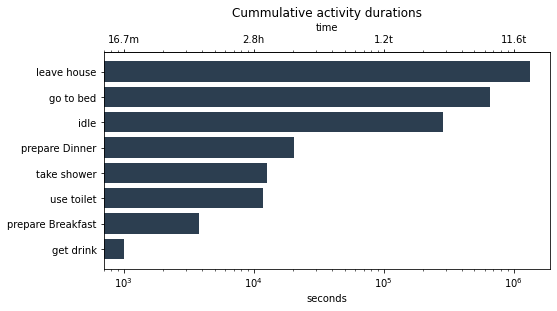
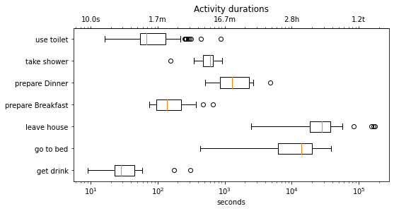
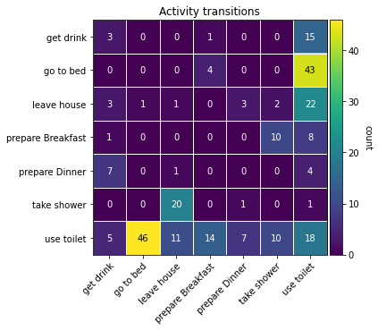
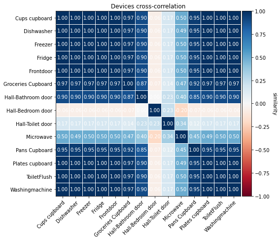
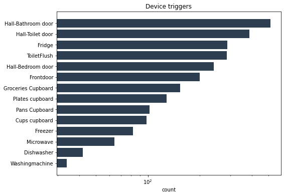
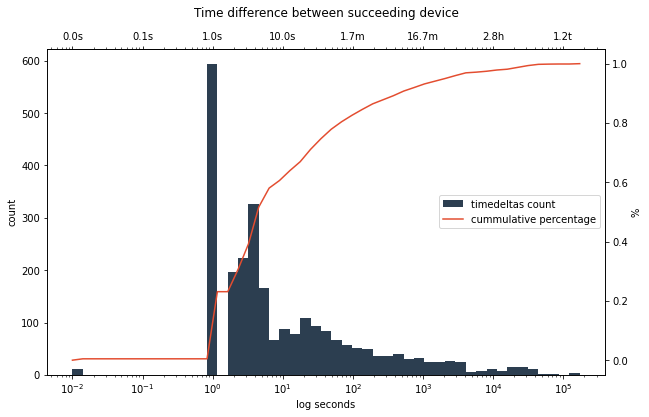
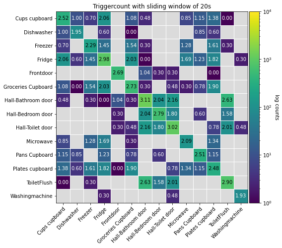
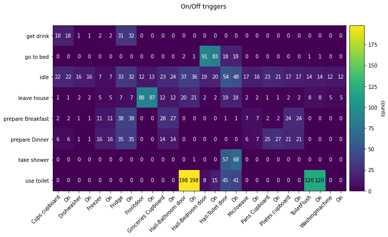
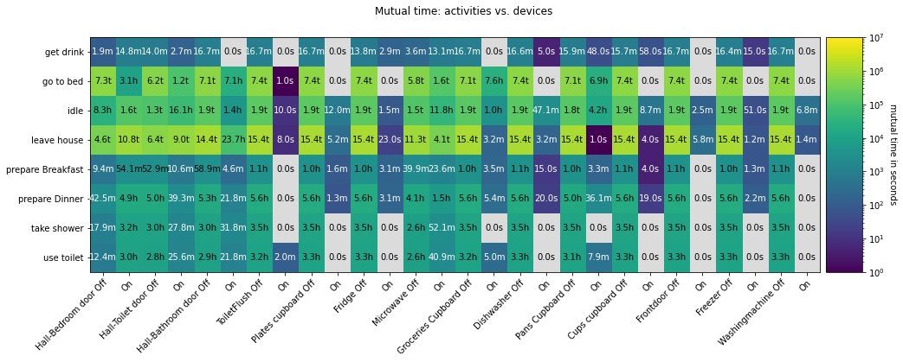

Statistics and Visualization
****************************
Pyadlml supports methods to quickly calculate summary statistics about a dataset. The methods
can be imported from the module ``pyadlml.stats``. Most plots visualize the summary statistics, therefore
the following sections lists them jointly. Methods for plotting can be found in the modules ``pyadlml.plot``.
For a complete list check the api :ref:`TODOAPILINK`. The :ref:`Amsterdam` dataset is used for the examples.

Activities
==========

Count
~~~~~

Get the total activity count with

.. code:: python

    >>> from pyadlml.stats import activity_count

    >>> activity_count(data.df_activities)
                activity  occurrence
    0          get drink         19
    1          go to bed         47
    2        leave house         33
    3  prepare Breakfast         19
    4     prepare Dinner         12
    5        take shower         22
    6         use toilet        111

and for a bar plot type

.. code:: python

    from pyadlml.plot import plot_activity_bar_count

    # for the use of idle see note below
    plot_activity_bar_count(data.df_activities, idle=True);

.. image:: ../_static/images/plots/act_bar_cnt.png
   :height: 300px
   :width: 500 px
   :scale: 90 %
   :alt: alternate text
   :align: center

.. Note::
    In almost every dataset there are gaps between activities where device readings are
    recorded but a corresponding activity label is missing. In order to still use a cohesive
    sequence some people (TODO cite) create an *idle* activity filling the gaps. To include
    the *idle* activity in the statistics pass the parameter ``idle=True`` to the method.

Duration
~~~~~~~~

Compute how much time an inhabitant spent performing an activity

.. code:: python

    >>> from pyadlml.stats import activity_duration

    >>> activity_duration(data.df_activities)
                activity       minutes
    0          get drink     16.700000
    1          go to bed  11070.166267
    2        leave house  22169.883333
    3  prepare Breakfast     63.500000
    4     prepare Dinner    338.899967
    5        take shower    209.566667
    6         use toilet    195.249567

Visualize the duration for the activities with a bar plot

.. code:: python

    from pyadlml.plots import plot_activity_bar_duration

    plot_activity_bar_duration(data.df_activities)

or use a boxsplot for more information

.. code:: python

    from pyadlml.plots import plot_devices_bp_duration

    plot_devices_bp_duration(data.df_activities)

Transition
~~~~~~~~~~

Compute a transition matrix that displays how often one activity was followed
by another.

.. code:: python

    >>> from pyadlml.stats import activity_transition

    >>> activity_transition(data.df_activities)
    act_after          get drink  go to bed  ...  use toilet
    activity
    get drink                  3          0  ...          15
    go to bed                  0          0  ...          43
    leave house                3          1  ...          22
    prepare Breakfast          1          0  ...           8
    prepare Dinner             7          0  ...           4
    take shower                0          0  ...           1
    use toilet                 5         46  ...          18

.. code:: python

    from pyadlml.plots import plot_activity_hm_transitions

    plot_activity_hm_transitions(data.df_activities)

Density
~~~~~~~

Approximate the activity density over one day for all activities using monte-carlo sampling

.. code:: python

    >>> from pyadlml.stats import activities_dist

    >>> transitions = activities_dist(data.df_activities, n=1000)
             prepare Dinner           get drink ...         leave house
    0   1990-01-01 18:12:39 1990-01-01 21:14:07 ... 1990-01-01 13:30:33
    1   1990-01-01 20:15:14 1990-01-01 20:23:31 ... 1990-01-01 12:03:13
    ..                      ...                 ...                 ...
    999 1990-01-01 18:16:27 1990-01-01 08:49:38 ... 1990-01-01 16:18:25

.. code:: python

    from pyadlml.plots import plot_activity_ridgeline

    plot_activity_ridgeline(data.df_activities)

.. image:: ../_static/images/plots/act_ridge_line.png
   :height: 300px
   :width: 500 px
   :scale: 90 %
   :alt: alternate text
   :align: center

.. note::
    It can happen that an activity is specified that does not appear in the activity file. To
    include those activities in the statistics, pass an activity list to the parameter
    ``activity_lst``.

Devices
=======

Information can be gathered by taking a closer look at how and when devices trigger as
well as how the different states depend on each other.

Duration
~~~~~~~~

Compute the time and the proportion a device was on and off

.. code:: python

    >>> from pyadlml.stats import device_on_off

    >>> device_on_off(data.df_devices)
                    device                  td_on                  td_off   frac_on  frac_off
    0        Cups cupboard 0 days 00:10:13.010000 27 days 18:34:19.990000  0.000255  0.999745
    1           Dishwasher        0 days 00:55:02        27 days 17:49:31  0.001376  0.998624
    ...                ...                    ...                     ...        ...      ...
    13      Washingmachine        0 days 00:08:08        27 days 18:36:25  0.000203  0.999797

and plot the result

.. code:: python

    from pyadlml.plots import plot_device_on_off

    plot_device_on_off(data.df_devices)

.. image:: ../_static/images/plots/dev_on_off.png
   :height: 300px
   :width: 500 px
   :scale: 100 %
   :alt: alternate text
   :align: center

More information about the time a device is *on* available using a boxplot.

.. code:: python

    from pyadlml.plots import plot_device_bp_on_duration

    plot_device_bp_on_duration(data.df_devices)

.. image:: ../_static/images/plots/dev_bp_dur.png
   :height: 300px
   :width: 500 px
   :scale: 90 %
   :alt: alternate text
   :align: center

Very often the similarity between device states is useful to evaluate, because uncorrelated device states provide
a better basis for machine learning algorithms. Values close to one indicate both devices being
on/off for the same time periods.

.. code:: python

    >>> from pyadlml.stats import device_duration_corr

    >>> device_duration_corr(data.df_devices)
    device              Cups cupboard  Dishwasher  ...  Washingmachine
    device                                         ...
    Cups cupboard            1.000000    0.997571  ...        0.999083
    Dishwasher               0.997571    1.000000  ...        0.996842
    ...
    Washingmachine           0.999083    0.996842  ...        1.000000
    [14 rows x 14 columns]

The visualization with a heatmap can be achieved by

.. code:: python

    from pyadlml.plots import plot_dev_hm_similarity

    plot_dev_hm_similarity(data.df_devices)

Triggers
~~~~~~~~

Compute the amount a device switches its state from on to off or the other way around.

.. code:: python

    >>> from pyadlml.stats import device_trigger_count

    >>> device_trigger_count(data.df_devices)
                    device  trigger_count
    0        Cups cupboard             98
    1           Dishwasher             42
    ..                 ...            ...
    13      Washingmachine             34

.. code:: python

    from pyadlml.plots import plot_device_bar_count

    plot_device_bar_count(data.df_devices)

Compute the pairwise differences between succeeding device triggers for all devices.

.. code:: python

    >>> from pyadlml.stats import device_time_diff

    >>> device_time_diff(data.df_devices)
    array([1.63000e+02, 3.30440e+04, 1.00000e+00, ..., 4.00000e+00,
           1.72412e+05, 1.00000e+00])

Using the :math:`\Delta t` s in a histogram provides an overview on how to choose the length
of a timeslice without destroying to much information. (see hint TODO link).

Compute the amount of triggers falling into timeframes spanning one day

.. code:: python

    >>> from pyadlml.stats import device_trigger_one_day

    >>> device_trigger_one_day(data.df_devices, t_res='1h')

    device    Cups cupboard  Dishwasher   ...  Washingmachine
    time                                  ...
    00:00:00            0.0         0.0   ...             0.0
    01:00:00           16.0         0.0   ...             0.0
    ...
    23:00:00            6.0         8.0   ...             2.0

Visualizing this as heatmap can ...

.. code:: python

    from pyadlml.plots import plot_device_hm_time_trigger

    plot_device_hm_time_trigger(data.df_devices, t_res='1h')

.. image:: ../_static/images/plots/dev_hm_trigger_one_day.png
   :height: 300px
   :width: 500 px
   :scale: 100 %
   :alt: alternate text
   :align: center

Compute for a certain time window how much devices trigger in that same window. Is
a way to show temporal relationships between devices

.. code:: python

    >>> from pyadlml.stats import device_trigger_sliding_window

    >>> device_trigger_sliding_window(data.df_devices)
                       Cups cupboard Dishwasher  ...  Washingmachine
    Cups cupboard                332         10  ...               0
    Dishwasher                    10         90  ...
    ...                          ...        ...  ...             ...
    Washingmachine                 0          0  ...              86

.. note:: Grey fields should be negativ infinity when using the ``z_scale=log`` and are
    presented as having no value for better visual bla.

Activites and devices
=====================

The interaction between devices and activities is of particular interest as the devices
predictive value for certain activities can be revealed.

The following code shows how to compute triggers happening during different activities.

.. code:: python

    >>> from pyadlml.stats import contingency_triggers

    >>> contingency_triggers(data.df_devices, data.df_activities)
    activity                     get drink ...             use toilet
    Hall-Bedroom door Off  0 days 00:01:54 ... 0 days 00:12:24.990000
    Hall-Bedroom door On   0 days 00:14:48 ... 0 days 03:02:49.984000
    ...                                ...
    Washingmachine On      0 days 00:00:00 ...        0 days 00:00:00
    [28 rows x 7 columns]

.. code:: python

    from pyadlml.plot import plot_hm_contingency_trigger

    plot_hm_contingency_trigger(data.df_devices, data.df_activities)

.. image:: ../_static/images/plots/cont_hm_trigger.png
   :height: 300px
   :width: 500 px
   :scale: 100 %
   :alt: alternate text
   :align: center

It may be the case that some devices turn *on* but not *off* during a specific activity. To
get to know those devices the triggers can be divided into the on and off states of the devices.

.. code:: python

    >>> from pyadlml.stats import contingency_triggers

    >>> contingency_duration(data.df_devices, data.df_activities)
    activity                     get drink ...             use toilet
    Hall-Bedroom door Off  0 days 00:01:54 ... 0 days 00:12:24.990000
    Hall-Bedroom door On   0 days 00:14:48 ... 0 days 03:02:49.984000
    ...                                ...
    Washingmachine On      0 days 00:00:00 ...        0 days 00:00:00
    [28 rows x 7 columns]

This leads to the following plot.

.. code:: python

    from pyadlml.plot import plot_hm_contingency_trigger_01

    plot_hm_contingency_trigger_01(data.df_devices, data.df_activities)

However more interesting than the triggers are the total durations that each device state
shares with an activity.

.. code:: python

    >>> from pyadlml.stats import contingency_duration

    >>> contingency_duration(data.df_devices, data.df_activities)
    activity                     get drink ...             use toilet
    Hall-Bedroom door Off  0 days 00:01:54 ... 0 days 00:12:24.990000
    Hall-Bedroom door On   0 days 00:14:48 ... 0 days 03:02:49.984000
    ...                                ...
    Washingmachine On      0 days 00:00:00 ...        0 days 00:00:00
    [28 rows x 7 columns]

.. code:: python

    from pyadlml.plot import plot_hm_contingency_duration

    plot_hm_contingency_duration(data.df_devices, data.df_activities)

Theming
=======

There are global options to set the color and colormaps of the plots.

.. code:: python

    from pyadlml.dataset import set_primary_color, set_secondary_color

    set_primary_color("#1234567")
    set_secondary_color("#1234567")

You can set global values for diverging and converging colormaps.

.. code:: python

    from pyadlml.dataset import set_converging_cmap, set_diverging_cmap

    set_primary_color()